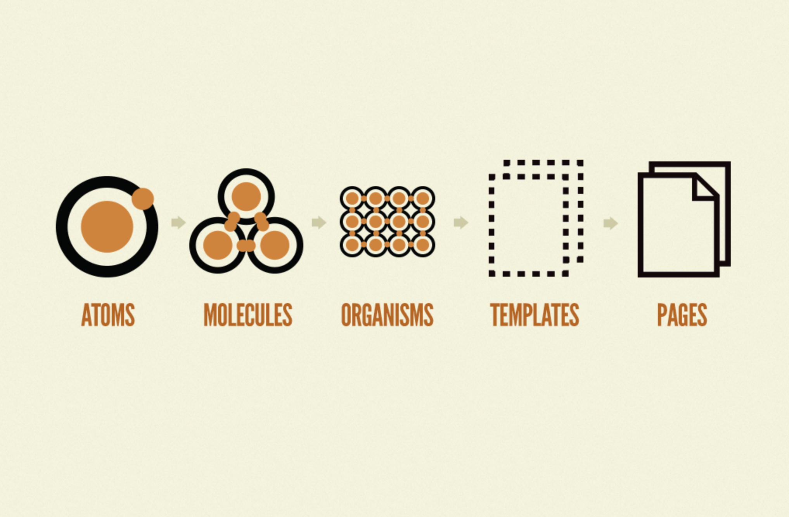
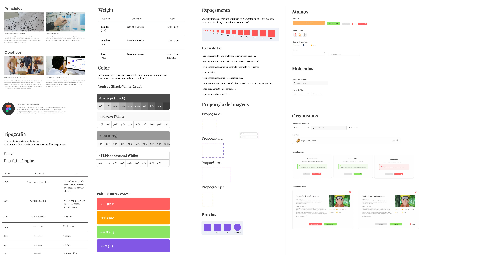
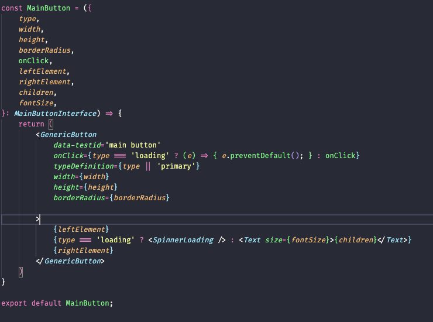
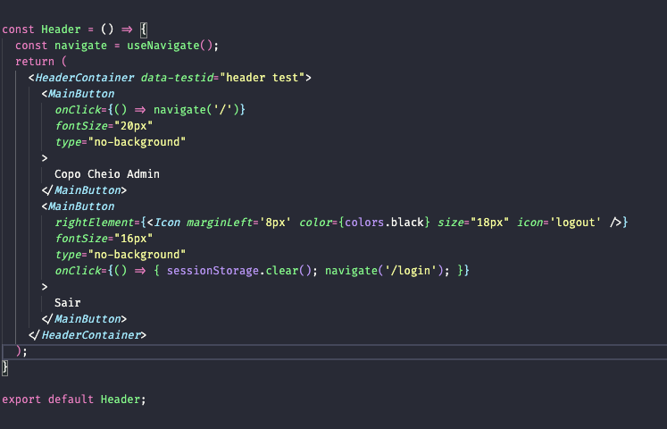
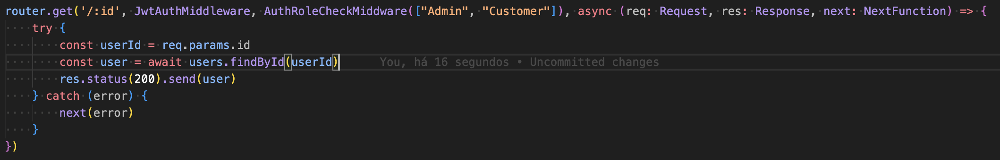
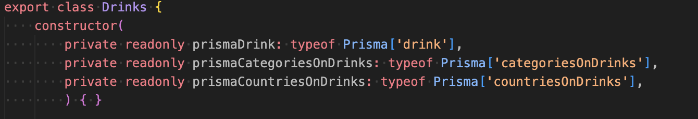
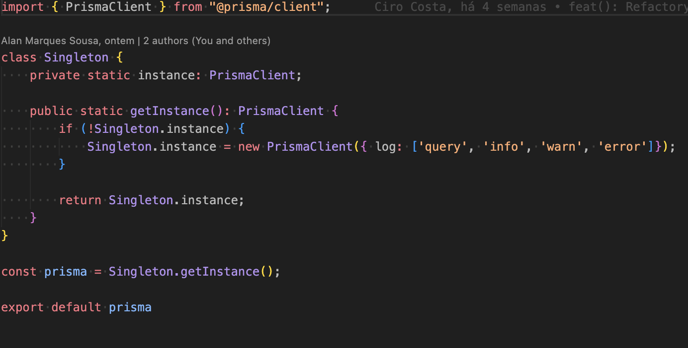

# Reutilização de Software

## Versionamento
| Versão | Data | Modificação | Autor(es) |
|:-:|:-:|:-:|:-:
| 0.1 | 30/01/2023 | Criação do documento | Gabriel Sabanai, Arthur Matos, Samuel Ávila, Artur de Sousa |

# Introdução

A reutilização de software é uma estratégia baseada no reúso de software e design já existente para a elaboração e o desenvolvimento de outro produto de software. Com isso é possível realizar entregas com menores custos de produção,  manutenção de software, realizar entregas mais rápidas e softwares com melhores qualidades.

A maximização da reutilização tem sempre sido uma importante meta de desenvolvimento de software. É melhor reutilizar o design e o código existentes do que despender recursos na criação, teste, e primeira liberação de algo novo com o risco dos problemas ocultos que todos os novos softwares têm. Os arquitetos e desenvolvedores qualificados tem papeis extremamente importantes nessa etapa pois conseguem identificar e alavancar oportunidades de reutilização.

Existem três perspectivas a serem consideradas quando da reutilização de software: código (implementação), design e framework ou arquitetura. Os arquitetos devem buscar a reutilização de significantes frameworks de aplicação, tais como camadas que pode ser aplicadas a muitos tipos diferentes de aplicações. Os desenvolvedores devem buscar os designs e padrões que possam ser reutilizados para produzir o comportamento desejado ou estruturas robustas. Eles devem também procurar uma forma de reduzir a quantidade de código a ser escrito pela alavancagem de código e componentes estáveis que tenham sido usados com sucesso em ambientes de produção.

## Design
Dentro do projeto utilizamos duas metodologias que busca padronizar os designs da aplicação e facilitar na sua reutilização, sendo eles, o [**Atomic Design**](https://atomicdesign.bradfrost.com/chapter-2/) e o [**Design System**](https://brasil.uxdesign.cc/afinal-o-que-%C3%A9-design-system-448c257b0021).

Com a filosofia química do Atomic Design, foi possível realizar a criação de componentes dos mais básicos(atomos) até os mais avançados(Pages), a ideia por trás é conseguir reutilizar o máximo possível esses componentes ao criar o design de novas telas.

__Figura 1: Atomic Design__

Já o Design System busca ser um ecossistema da implementações com componentes programados e padrões de desing, que no caso reune padrões de comportamento.

__Figura 2: Design System__

## Reutilização Front-End
### ReactJS + Typescript
O React é uma biblioteca front-end de código aberto que foi criado em 2011 pelo Facebook e lançado em 2013. Possuí três pilares de desenvolvimento, sendo eles:
* Componentes
* Estados
* Propriedades

Dessa forma, o React utiliza de componentes para conseguir padronizar e reutilizar códigos dentro do projeto. Os componentes utilizam das propriedades para passar informações dinâmicas para a instancia dos componentes. Por fim, os estados ficam responsáveis pela gerencia de renderização a partir da mudança de estados.

Na figura 3 temos a criação de um componente React, já na figura 4 temos a utilização desse mesmo componente passando propriedades dinamicas.

__Figura 3: Button Component__

__Figura 4: Using Button Component__

## Reutilização Back-End

### Express JS

O Express JS é um framework de código aberto que auxília o desenvolvimento de aplicações web e APIs, utilizando o Node como interpretador. Foi lançado em 2010, sendo hoje um dos mais populares frameworks javascript para aplicações backend.

### Prisma JS
O Prisma é um ORM NodeJS que consiste em três ferramentas principais:

Prisma Client: um construtor de consultas gerado automaticamente e fortemente tipado para o Node.js e o TypeScript.

Prisma Migrate: um sistema declarativo de modelagem e migração de dados.

Prisma Studio: uma GUI para visualizar e editar dados em seu banco de dados.

No projeto foram utilizados as ferramentas de Client e Migrate.

#### Prisma Client

#### Prisma Migrate

O prisma migrate é uma ferramenta cli, sendo executado com:
> npx prisma migrate dev

### PrismaConection Singleton
Foi criada uma classe singleton para estabelecer conexão com o banco de dados de maneira única.

### Docker
O Docker foi lançado em 2013 e é uma plataforma open source que faz o empacotamento de aplicações ou ambientes, tornando os portáteis e com uma maior flexibilidade de utilização.

No projeto o Docker foi de grande ajuda para facilitar a integração dos membros do grupo, proporcionando um ambiente de programação padronizado, fazendo com que não houvesse grandes problemas de versões de linguagens e frameworks, resolvendo também problemas de dependências.

Além disso, ele também resolve um problema de interdependência de serviços, fazendo por exemplo o controle de ordem e dependência entre containers.

## Referências

> Eclipse Process Framework Version 1.2(c) Copyright Eclipse contributors and others 2004, 2007.
All Rights Reserved. Disponível em: <https://www.cin.ufpe.br/~rls2/processo_tg/Metodologia%20S&B/guidances/guidelines/software_reuse_6BA25ECC.html>. Acesso em: 30 Jan. 2023.

> Docker Documentation.
All Rights Reserved. Disponível em: <https://docs.docker.com/>. Acesso em: 30 Jan. 2023.

> Atomic Design.
All Rights Reserved. Disponível em: <https://atomicdesign.bradfrost.com/chapter-2/>. Acesso em: 30 Jan. 2023.

> Design System.
All Rights Reserved. Disponível em: <https://brasil.uxdesign.cc/afinal-o-que-%C3%A9-design-system-448c257b0021/>. Acesso em: 30 Jan. 2023.

> React
All Rights Reserved. Disponível em: <https://pt-br.reactjs.org/docs/components-and-props.html#:~:text=Conceitualmente%2C%20componentes%20s%C3%A3o%20como%20fun%C3%A7%C3%B5es,que%20deve%20aparecer%20na%20tela./>. Acesso em: 30 Jan. 2023