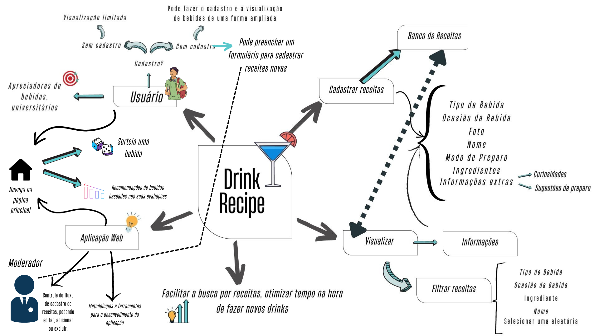
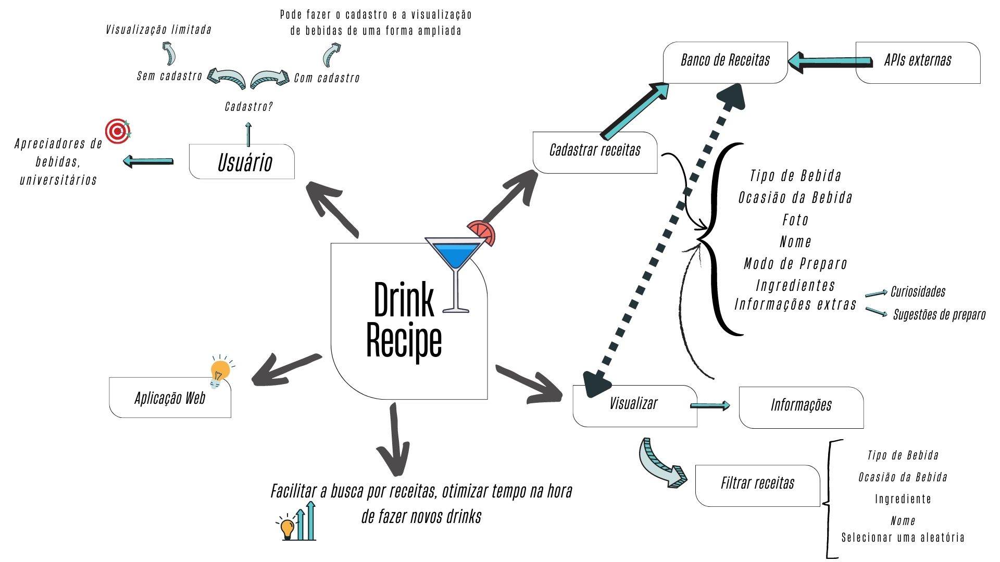
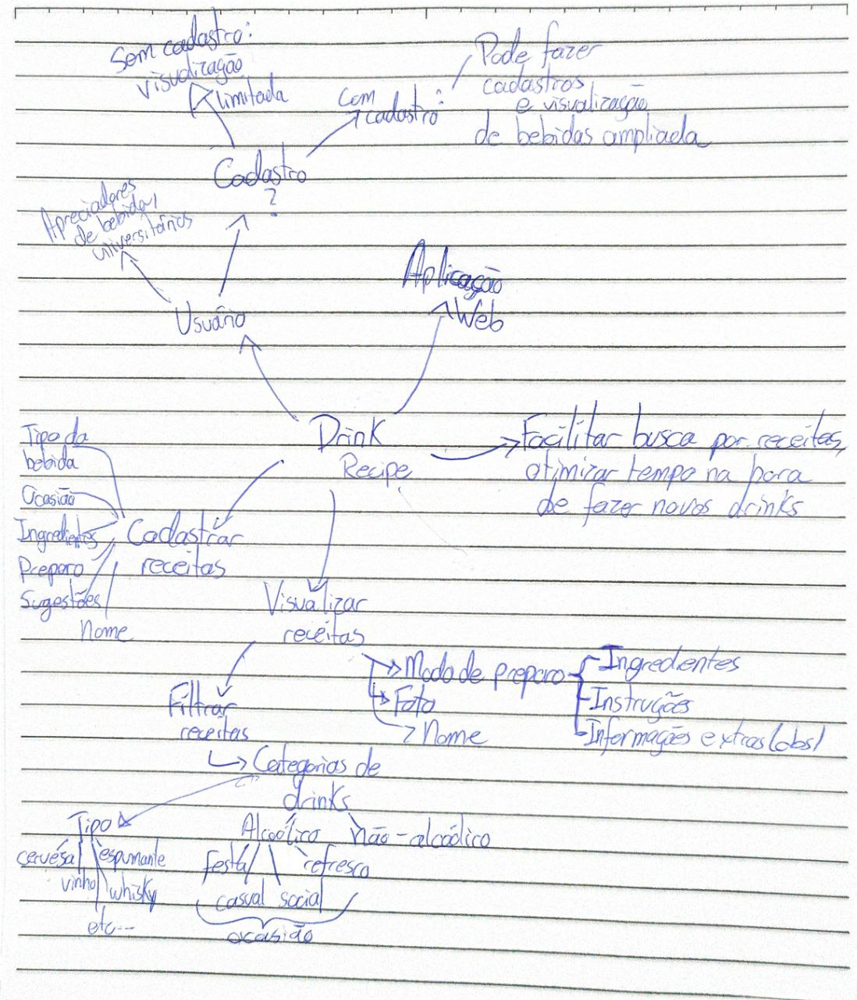

# Mapa Mental

## Versionamento

versão | data | Modificação | Autor
-------|------|-------------|------
0.1.0 | 16/11/2022 | Criação do documento | Samuel e Lucas
0.2.0 | 16/11/2022 | Elaboração da primeira versão do mapa mental | Samuel
0.2.1 | 16/11/2022 | Elaboração da segunda versão do mapa mental | Samuel e Lucas
0.3.0 | 17/11/2022 | Elaboração da terceira versão do mapa mental | Samuel e Lucas
0.3.1 | 18/11/2022 | Correção textual e padronização | Artur de Sousa

*Tabela 1: Versionamento*

## Introdução

O mapa mental é um artefato feito para nos ajudar a compreender melhor o domínio do nossso projeto. Com ele é possível concretizar algumas ideias sobre o que exatamente seria um software de receitas de bebidas. Algumas das perguntas que nos orientaram nesse processo foram: Quem utilizaria o software? Como vamos popular o banco de receitas? O que os uusuários precisam ver em uma receita? Como os usuários fariam busscas pelas receitas?

## Metodologia

Sendo assim, começamos a colocar no papel nossa visão sobre a ideia do produto de maneira ampla, também tivemos inspiração de outra metodologia para isso: o Brainstorming. A partir disso, foi feita uma primeira versão do mapa mental do modo tradicional (papel e caneta) e depois foi feita uma versão digital, utilizando o Canva. 

## Artefatos obtidos

Após algumas discussões com o time muitos aspectos abordados no mapa mental foram esclarecidas (dúvidas sobre o desenvolvimento e sobre o que realmente seria o produto foram resolvidas) e foi feita uma versão após a reunião para que ficasse mais claro como estávamos enxergando nosso produto. Essa última versão pode ser observado abaixo: 

*Figura 1: Última versão do mapa mental*

As principais diferenças observadas estão dentro dos ramos referentes ao usuário e à aplicação. Um ponto muito importante foi sobre como foi decidido que seriam cadastradas as receitas, vimos a necessidade de ter um moderador/administrados no aplicativo e isso fez uma grande diferença pra como enxergávamos nosso produto. Seguem as primeiras versões do mapa mental:

*Figura 2: Segunda versão do mapa mental*

*Figura 3: Primeira versão do mapa mental*

## Referências

[1] SERRANO, Milene. [DSW-Base - Mapa Mental](https://unbbr-my.sharepoint.com/personal/mileneserrano_unb_br/_layouts/15/stream.aspx?id=%2Fpersonal%2Fmileneserrano_unb_br%2FDocuments%2FArqDSW%20-%20VídeosOriginais%2F02e%20-%20VideoAula%20-%20DSW-Base%20-%20MapaMental%2Emp4&ga=1). Material apresentado para a disciplina de Arquitetura e Desenho de Software no curso de Engenharia de Software da UnB, FGA. Acesso em: 16 de novembro de 2022.