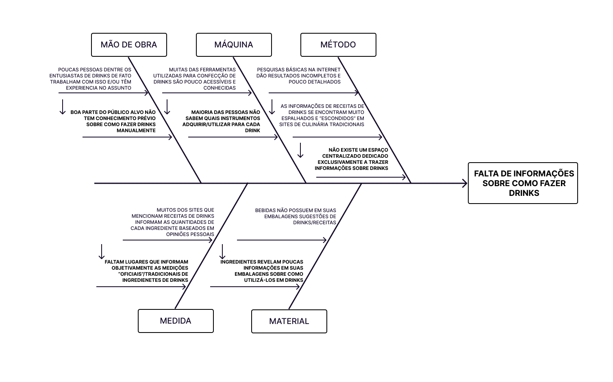
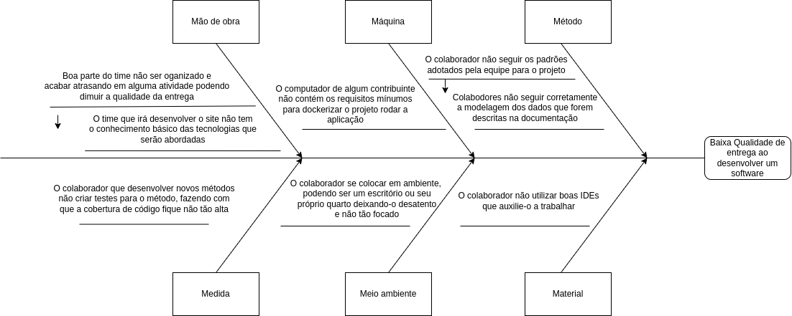

# Diagrama Causa e Efeito

Versionamento

versão | data | Modificação | Autor
-------|------|-------------|------
0.1.0 | 16/11/2022 | Criação do documento | Paulo e Batista

*Tabela 1: Versionamento*

## Introdução

O Diagrama de causa e efeito ou diagrama de peixes por sua representação ser bem parecida com peixe onde suas esquemas representam as causa, ou também, conhecido como Diagrama de Ishikawa por ser desenvolvido pelo engenheiro químico Kaoru Ishikawa, é muito utilizado para as pessoas que querem organizar, elicitar e entender as possíveis causas de um efeito/problema ao executar algum processo ou atividade.

Este diagrama tem como objetivo entender os principais fatores que podem causar gargalos, dificuldades e adversidades à um determinado processo.

Para a eloboração deste diagrama, devemos elencar os fatores/causas em 6 categorias baseadas nos 6M da manufatura, onde as 6 categorias são são respectivamente: *Método, Matéria-Prima, Mão de obra, Máquinas, Medição, Meio Ambiente*.

Em nossa documentação, iremos utilizar duas abordagens distantas para entender uma necessidade, a primeira será para entendermos as possíveis causas de atrasos ao se desenvolver o software e a segunda será para entendermos mais sobre as necessidades dos nosso perfil de usuário.

## Artefatos obtidos

 

### Diagrama com foco na resolução do problema tema

*Diagrama de causa e efeito: Site de receitas*

### Diagrama com foco na elaboração do projeto

 

 

*Diagrama de causa e efeito: Elaboração do projeto*