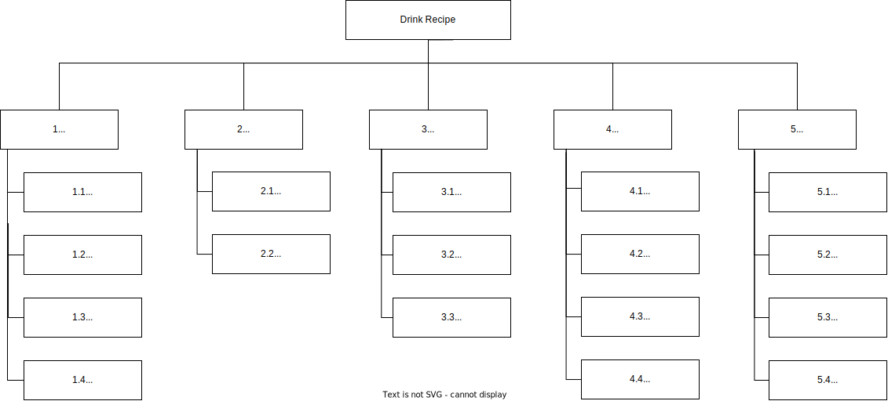

# PLANO DE RISCOS

## Histórico de Revisão
| Data | Versão | Descrição | Autor(es) |
| :--: | :----: | :-------: | :-------: |
| 16/11/22 | 0.1 | Criação do documento, indicação de tópicos e referências | [Leonardo Takehana](https://github.com/ltakehana) |

## Introdução

Este documento, tem como objetivo, elencar os riscos do projeto e o gerênciamento a ser realizado, incluindo pessoas, custos, escopo e outros fatores que possam influenciar no desempenho da equipe e qualidade do projeto.

## Estrutura Análitica de Riscos

### Descrição dos Itens da Estrutura analítica de Risco

#### Gerencia de projeto
- **Estimativa**: São erros relacionados a estimativas que podem influênciar no projeto, como pontuações para tomada de decisão e cronogramas.
- **Planejamento**: São riscos referentes a erros de planejamento que podem ocorrer durante o projeto.
- **Controle**: São riscos devidos a não atuação em riscos já identificados.
- **Comunicação**: São erros referentes a falta de comunicação e entendimento entre os membros da equipe.

#### Organizacional
- **Recursos Humanos**: São riscos relacionados aos recursos humanos, como por exemplo, desistência de algum membro da equipe, desmotivação, inexperiência, confrontos internos, dentre outros.
- **Priorização**: São riscos ocasionados por uma falta de priorização das atividades, que pode gerar um atraso em entregas.

#### Externos
- **Ambiente**: São fatores relacionados ao ambiente vivido, como por exemplo a inacessibilidade à FGA, devido a chuvas fortes, ou a falta de energia em brasília, envolvimento do país em algum confronto armado, suspensão do semestre por fatores externos, doenças e infecções epidemicas, dentre outros fatores.
- **Usuários**: São riscos relacionados aos usuários, como baixa adesão ao sistema, falta de familiaridade com a interface, baixas avaliações e NPS, dentre outros.
- **Regulador**: Riscos relacionados aos órgãos reguladores, como por exemplo a proíbição da venda de bebidas.

#### Técnico
- **Requisitos**: Riscos relacionados a elicitação de requisitos, podendo causar problemas de escopo e erros na priorização.
- **Tecnologia**: São riscos relacionados a tecnologia utilizada no projeto, como capacitação dos desenvolvedores, defasagem da tecnologia, falta de suporte e manutenção, dentre outros.
- **Complexidade**: São riscos relacionados a complexidade de execução de algumas atividades, o que pode ocasionar atraso nos processos.
- **Infraestrutura**: São riscos relacionados a estrutura física do projeto, como por exemplo problemas relacionados aos computadores dos desenvolvedores, problemas de custos com servidores, a falta de acesso devido a restrições de firewall, dentre outros.

#### Qualidade
- **Funcionalidade**: São riscos relacionados a funcionalidade do software, como por exemplo bugs que podem ocorrer, ou a falta de algum requisito básico para o funcionamento.
- **Usabilidade**: São riscos relacionados a usabilidade e a forma como os usuários conseguem utilizar o sistema, como por exemplo a criação de uma interface que pode ser complicada de mais e acabe fazendo com que o sistema não tenha adesão.
- **Eficiência**: São riscos relacionados a o desempenho e a eficiencia do sistema, como por exemplo, garantir que o sistema não irá travar e irá oferecer as respostas de maneira rápida e concisa.
- **Portabilidade**: São riscos relacionados ao uso do sistema em diferentes dispositivos, como computadores, celulares e tablets de diferentes tamanhos de tela.

## Análise quantitativa dos riscos
A análise quantitativa dos riscos será feita através da matriz de probabilidade e impacto, cada risco é classificado de acordo com a sua probabilidade de ocorrência e impacto em um objetivo, se ele realmente ocorrer. A organização deve determinar que combinações de probabilidade e impacto resultam em uma classificação de alto risco, risco moderado e baixo risco.

### Probabilidade
| Probabilidade | Peso |
| :-----------: | :--: |
| Muito Baixa | 1 |
| Baixa	| 2 |
| Média | 3 |
| Alta | 4 |
| Muito Alta | 5 |

### Impacto
| Impacto | Descrição | Peso |
| :-----: | :-------: | :--: |
| Muito Baixo |	Quase imperceptível para o projeto | 1 |
| Baixo	| Emite pouco impacto sobre o projeto |	2 |
| Médio | Existe um impacto considerável, mas é recuperável |	3 |
| Alto | Existe grande impacto no projeto | 4 |
| Muito Alto | Impede o prosseguimento do projeto | 5 |

### Prioridade
| P/I | Muito Baixo  | Baixo | Médio | Alto | Muito Alto |
| :-: | :----------: | :---: | :---: | :--: | :--------: |
| Muito Baixa |	1 | 2 | 3 | 4 | 5 |
| Baixa	| 2 | 4 | 6 | 8 | 10 |
| Média | 3 | 6 | 9 | 12 | 15 |
| Alta | 4 | 8 | 12 | 16 | 20 |
| Muito Alta | 5 | 10 | 15 | 20 | 25 |

## Matrizes de impacto

### Riscos de Gerência de projeto
| Risco | Impacto | Probabilidade | Prevenção | Resposta | Prioridade |
| :---: | :-----: | :-----------: | :-------: | :------: | :--------: |
| Escopo mal definido | Muito Alto | Media | Realizar uma etapa de elicitação de requisitos bem feita | Adequar o escopo para algo viável de ser realizado | 15 |
| Cronograma atrasado | Muito Alto | Baixa | Realizar um cronograma viável com base na experiência dos membros e no tempo disponível | Refatorar o Cronograma | 10 |
| Problemas no autogerenciamento da equipe | Muito Alto | Media | Conscientizar os membros com relação ao trabalho em equipe | Cobrança e ajuda mútua por parte dos membros  | 15 |
| Falta de atuação em risco já identificado | Muito Alto | Baixa | Visualizar o plano de riscos e verificar caso algum risco esteja próximo de se tornar um problema | Atuação rápida em cima dos riscos identificados | 10 |
| Falta de integração entre os códigos por falta de organização | Muito Alto | Media | Realizar reuniões de acompanhamento para alinhar sobre o progresso da equipe e necessidades do projeto | Conversa com os membros efetivos e refatoração do código caso necessário | 10 |

### Riscos organizacionais
| Risco | Impacto | Probabilidade | Prevenção | Resposta | Prioridade |
| :---: | :-----: | :-----------: | :-------: | :------: | :--------: |
| Falta de motivação, comprometimento ou trancamento da disciplina por algum integrante da equipe | Muito Alto | Media | Conversas constantes entre os membros | Replanejamento de atividades, visando deixar os membros mais confortáveis | 15 |
| Confronto interno da equipe, causando brigas entre os membros | Muito Alto | Baixa | Conversa constante entre os membros e reforçar o trabalho em equipe | Intervenção dos outros membros de maneira rápida e concisa | 10 |
| Falta de experiência dos membros no projeto | Media | Media | Programação em pareamentos com pessoas mais experiêntes junto de pessoas menos experiêntes | Capacitação dos membros menos experiêntes através de outros integrantes da equipe | 9 |
| Priorização de atividades pouco relevantes | Alto | Media | Definir as atividades a serem realizadas em conjunto | Realizar um acompanhamento das atividades e replanejar caso necessário | 12 |

### Riscos Externos
| Risco | Impacto | Probabilidade | Prevenção | Resposta | Prioridade |
| :---: | :-----: | :-----------: | :-------: | :------: | :--------: |
| Suspensão do semestre por conta de algum fator externo como uma epidêmia ou condições climáticas | Muito Alto | Muito Baixa | Não há o que fazer nessa situação | Suspender o desenvolvimento do APP até a volta do semestre | 5 |
| Feedbacks negativos com relação ao APP | Alto | Media | Realização de pesquisas com o público alvo | Reestruturação do escopo da aplicação para verificar o que é viável de mudança para atender aos gostos do público | 12 |

### Riscos técnicos
| Risco | Impacto | Probabilidade | Prevenção | Resposta | Prioridade |
| :---: | :-----: | :-----------: | :-------: | :------: | :--------: |
| Dificuldade de Identificar requisitos | Muito Alto | Media | Utilizar diversas técnicas para elicitar requisitos | Refinar o escopo em conjunto da equipe e elicitar novamente caso necessário | 15 |
| Baixo dominio das tecnologias | Medio | Media | Programação em pareamentos com pessoas mais experiêntes junto de pessoas menos experiêntes | Capacitação dos membros menos experiêntes através de outros integrantes da equipe | 9 |
| Complexidade na execução de uma funcionalidade que não consegue ser resolvida | Media | Alta |Mensurar previamente o nivel de conhecimento individual dos membros sobre as tecnologias usadas | Realocação de membros para o desenvolvimento da funcionalidade e capacitação por parte dos membros mais experiêntes | 12 |
| O servidor escolhido não consegue suportar a quantidade de requisições | Alto |Muito Baixa |Mensurar previamente o desempenho da aplicação e do servidor e escolher uma opção viável para a implementação | Contratação de um novo servidor para hospedagem da aplicação | 4 |

### Riscos de Qualidade
| Risco | Impacto | Probabilidade | Prevenção | Resposta | Prioridade |
| :---: | :-----: | :-----------: | :-------: | :------: | :--------: |
| Ausência de testes | Muito Alto | Baixa | Realização dos testes automatizados na aplicação e alta prioridade para os mesmos | Realização emergêncial de outros tipos de testes | 10 |
| Falhas e bugs na aplicação | Muito Alto | Media | Realização de testes e revisão via pareamento | Refatoração do código para a correção dos bugs | 15 |

## Referências

1. https://2019-2-arquitetura-desenho.github.io/wiki/dinamica_seminario_II/controle_riscos/
2. https://github.com/DesenhoMaster2017/SpaceShooter/wiki/Plano-de-Riscos
3. https://desenhosoftware-2018-2.github.io/wiki/gerenciamentoRiscos
4. https://github.com/Desenho-Grupo2/PlanUp/wiki/Plano-de-Gerenciamento-de-Riscos
5. https://www.youtube.com/watch?v=HDMS7ftQJb0
