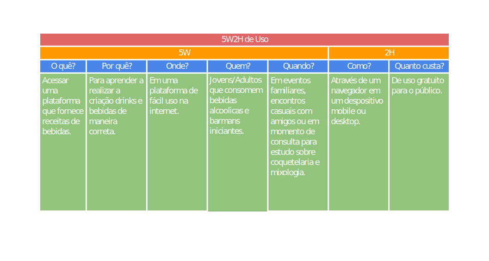

# 5W2H

## Versionamento


versão | data | Modificação | Autor
-------|------|-------------|------
0.1.0 | 16/11/2022 | Criação do documento | Arthur

*Tabela 1: Versionamento*

## Introdução

Para definição direta e com maior clareza do projeto, foram elaborados duas tabelas 5W2H. O artefato em questão tem o objetivo de estabelecer planos de ação eficientemente, mas também, pode ser empregado para a documentação objetíva sobre os principais aspectos de um projeto.

Sua estrutura é composta por uma série de perguntas diretas, advindas do inglês *"What? Why? Who? Where? When? How? How much?"* que buscam descrever os papeis e conceitos de uma determinada etapa de processo.

Para o contexto do projeto, foram gerados 2 destes artefatos, sendo estes referêntes a especificação do uso esperado da plataforma, bem como a ação geral da equipe ao longo do projeto.

## Artefatos obtidos



*5W2H: Especificação de uso*


*5W2H: Definição geral da ação da equipe*


#### Observação ao custo

De acordo ao site [Glassdoor](https://www.glassdoor.com.br/Sal%C3%A1rios/estagi%C3%A1rio-de-desenvolvimento-sal%C3%A1rio-SRCH_KO0,29.htm#:~:text=As%20estimativas%20de%20sal%C3%A1rios%20t%C3%AAm,aproxima%20da%20realidade%20para%20voc%C3%AA%3F) o salário médio de um estagiário de desenvolvimento está em R$ 1494,00 no mês de novembro de 2022. Foi utilizado esse valor como base do cálculo de custo dos desenvolvedores apresentado. Sendo esse valor a base salárial consideráda, foi estabelecido o valor final da seguinte forma:

>   ```Média Salário Estagiário de Desenvolvimento * Tempo de Projeto * Número de desenvolvedores.
>       R$ 1494,00 * 3 meses * 12 desenvolvedores = R$ 53.784,00
>   ```