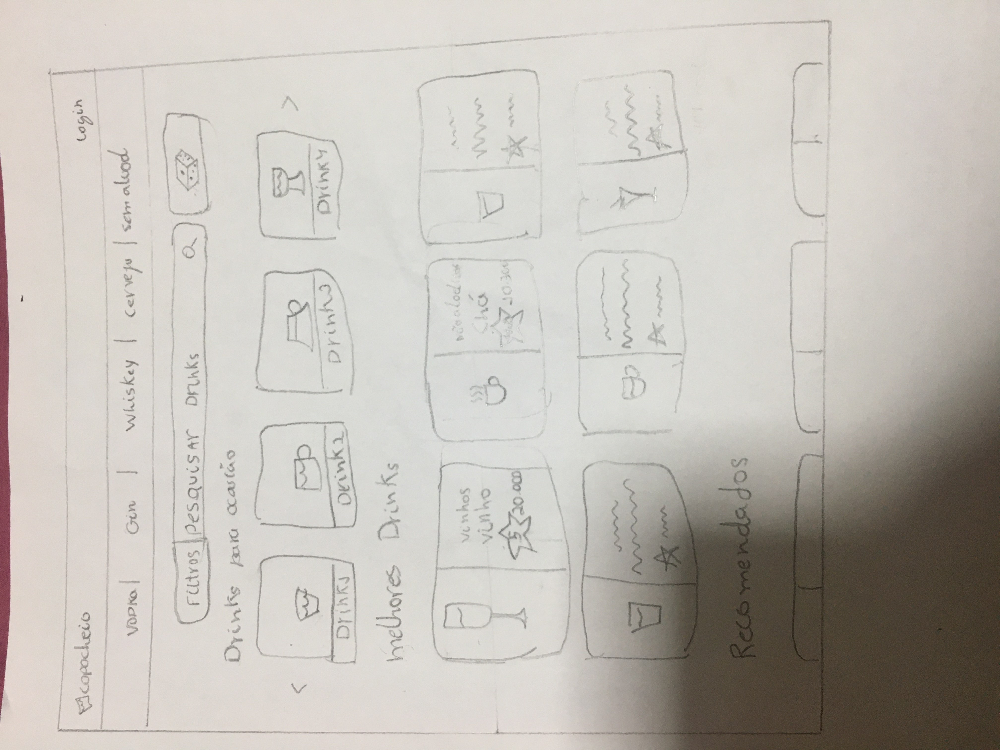
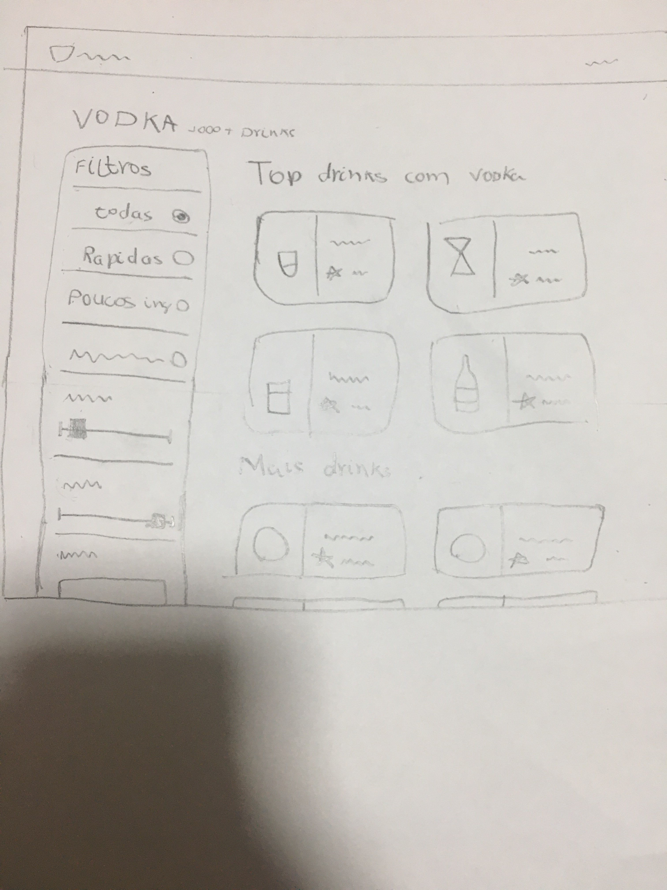
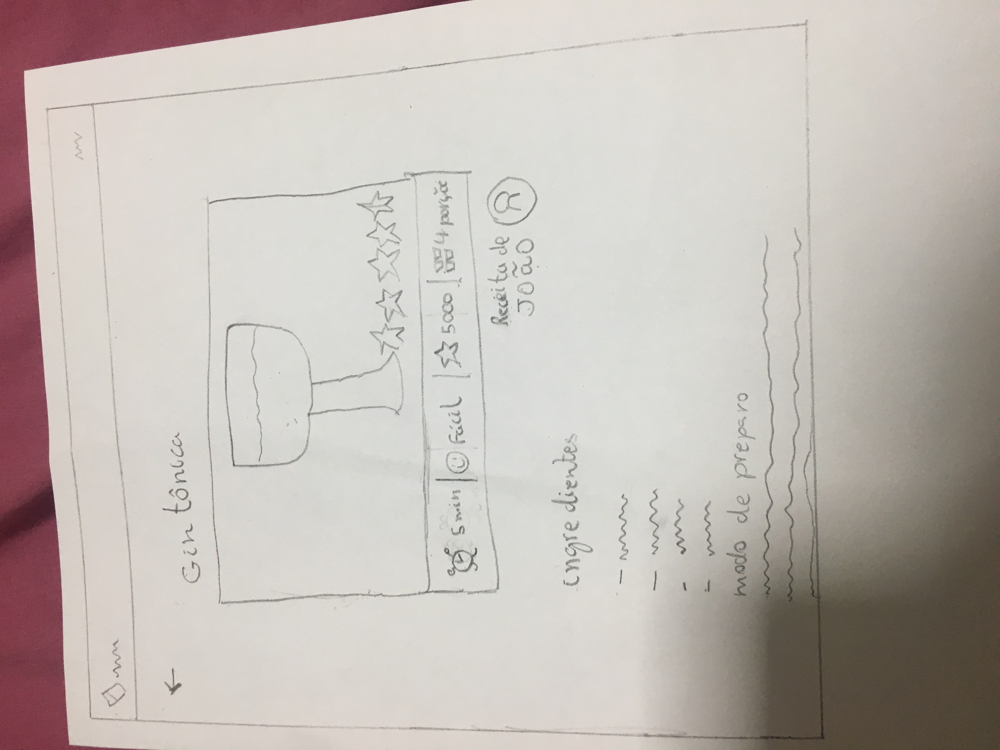
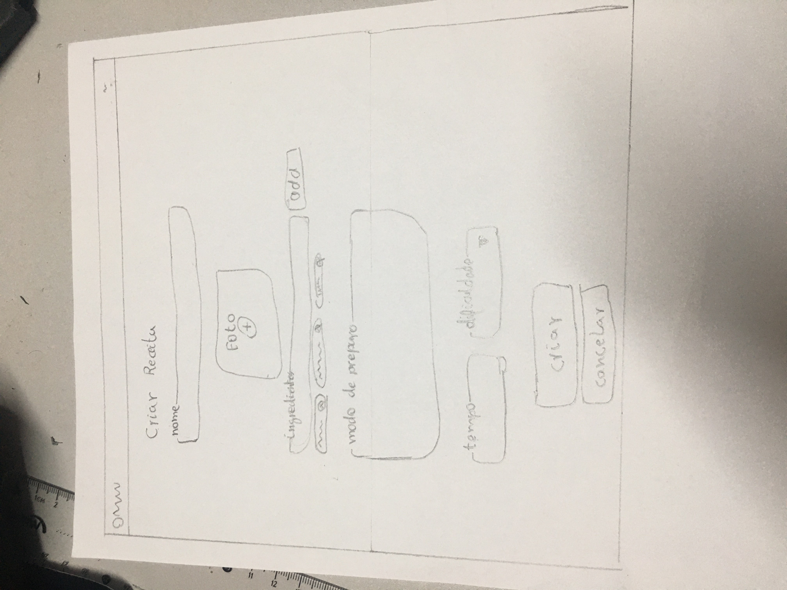
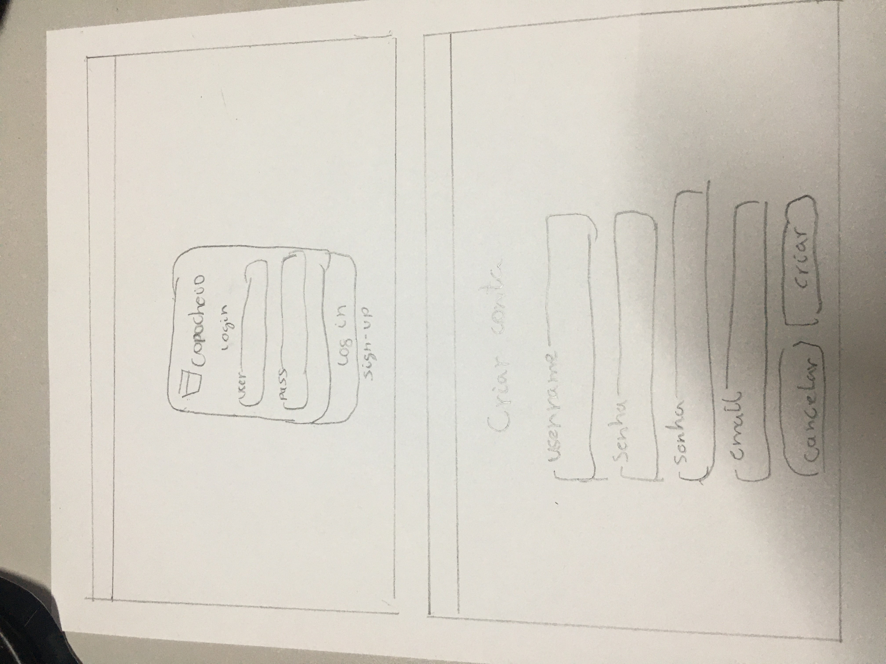
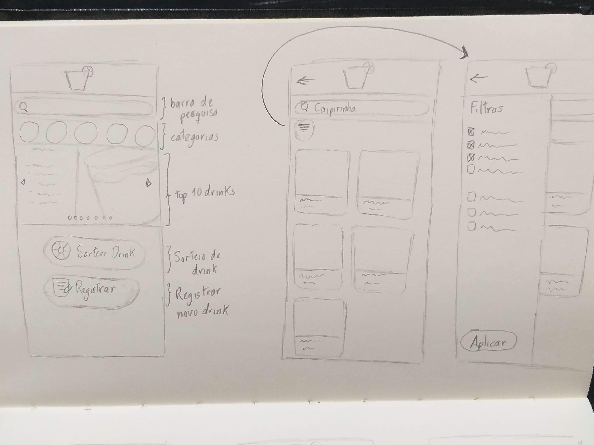
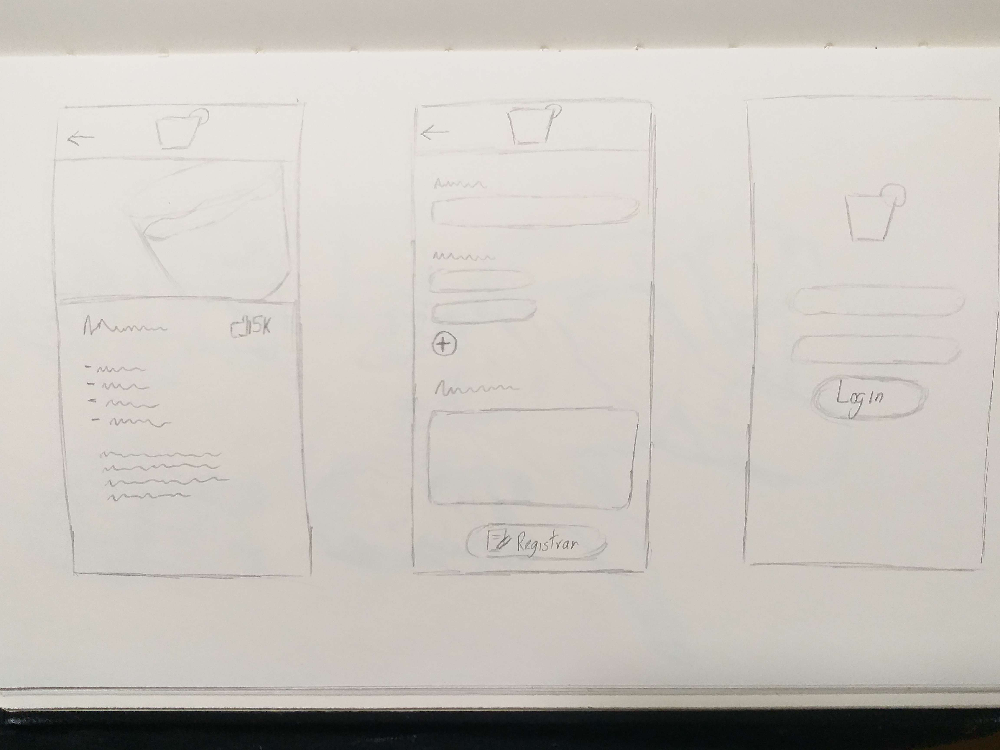
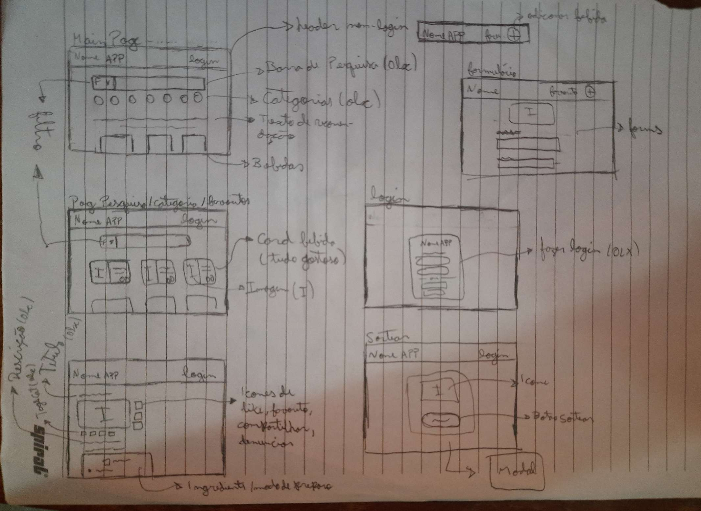

# Design sprint

| Versão | Alterações | Responsável|
| ------ | ---------- | ---------- |
| 0.1.0  | Criação do documento e adição dos protótipos de baixa fidelidade | Thiago França |
| 0.2.0 | Documentação completa do Design Sprint e adição de mais prototipos e adição de referencias | Gabriel Sabanai |

*Tabela 1: Versionamento*

## Introdução

O Design Sprint é um processo, desenvolvido pela Google Ventures, de 5 dias de trabalho que tem como objetivo responder as questões mais críticas do produto, por meio do design, prototipação e validações de ideias. Considerado um sucesso para formação estrategica, de inovação e de designt thinking de uma solução.

Como dito anteriormente é um trabalho contando 5 dias de duração, começando na segunda e terminando na sexta, no qual, cada um dos dias tem um trabalho especifico e fundamental para o andamento da sprint, como é possível observar na figura 1, anexada abaixo.


*Figura 1: Design Sprint*

Assim sendo, abaixo iremos descrever sobre cada um dos dias e o processo do time de elaboração do desgin sprint, vale ressaltar que a os processos não foram seguidos a risca devido o contexto dos membros da equipe.

### Segunda - Compreender
Nesse processo, o time irá vai compartilhar tudo que sabe sobre o projeto (problemas e ideias). Em seguida, é recomendado criar um mapa mental, para assim validarmos com aqueles que tem maior visão ou necessidade do projeto. Por fim, será elaborado um objetivo concreto do que iremos desenvolver ao longo da sprint.

Durante essa etapa, o grupo se juntou e realizou diversas operações que ajudassem a elicitar ideias e identificar problemas. Dessa forma, a equipe se juntou para realizar um brainstorm, fez a criação de dois mapas mentais e também de dois rich pictures.

### Terça - Divergir
É realizado uma revisão das idéias existentes, para a melhoria ou adição de alguma ideia. A ideia é cada um dos membros seguirem com um sketch e apresentarem para o grupo para ser revisado e decidido.

Nessa etapa, o grupo optou por fazer uma revisão tanto dos mapas mentais, brainstorms, e, principalemente, dos rich pictures, já que, assim, foi possível analisar e discutir todas as soluções propostas e conseguindo avaliar o que funcionava ou não.

### Quarta - Decidir
Durante essa fase, as soluções escolhidas da etapa anterior são lápidadas ao ponto de ser possível construi um plano solido. Assim sendo, cada um dos pontos levantados serão discutidos e definidos se entram no escopo ou não. Por fim, um storyboard é criado com o passo a passo do plano para o prototypo.

No decorrer desse estagio, o time repassou mais uma vez pelo o Rich Picture e refinou cada uma das soluções e funcionalidades do fluxo. Logo após, o próprio Rich Picture foi atualizado com as funcionalidades que foram decididas para entrar no escopo do produto, atuando assim como nosso storyboard.

### Quinta - Prototipação
Na quinta, a ideia é pegar o que foi elaborado no storyboard e criar um prototipo, pouco focado no design ou nas cores, mas realista o suficiente para as pessoas consigam compreende-lo. Além disso, será elaborado um questionario para que seja realizado um teste e validação com usuários.

Durante esse momento, priorizamos aplicar os conhecimentos adquiridos em IHC e em Requisitos, foi definido dividir o protótipo em "prototipos de baixa fidelidade" e depois em "prototipo de alta fidelidade". Assim sendo, foram criados alguns prototipos de baixa fidelidade para que conseguissimos levantar ideias para o design.
O site será construído de forma 100% responsiva para dispositivos móveis. Por isso, foram feitos dois protótipos, um para rodar em desktop e um para mobile.

É possível visualizar nas figuras 2, 3, 4, 5, 6, 7 e 8 os modelos criados pelos membros João Victor Batista, Thiago Fraça e Gabriel Sabanai.

Versão desktop



*Figura 2: Página principal*



*Figura 3: Página busca de bebidas*



*Figura 4: Página da receita da bebida*



*Figura 5: Página de cadastro de bebidas*



Versão mobile



*Figura 6: Página principal e de busca versão mobile*



*Figura 7: Página de drink, login e cadastro de usuário versão mobile*



*Figura 8: Prototipo baixa fidelidade*


### Sexta - Validação
Por fim, a ultima etapa é definida pela realização da testagem e validação das features dos prototipos por grupo de usuários selecionados pela equipe. O importante dessa etapa é acompanhar todo o fluxo de testagem do usuário teste e, assim, prestar atenção nas suas reações e realizar perguntas durante o processo.

Na ultima etapa, como a equipe decidiu acresentar a criação do prototipo de alta fidelidade, não foi possível realizar os testes e as validações ainda. Isso se deve por dois motivos, tanto pelo o processo de alta fidelidade não estar finalizado, já que envolve a finalização de processos de design mais complexos, como pelo contexto da equipe e o tempo necessário para realizar um processo de qualidade.

## Referências
[//]: # "TODO: alterar numeração e incluir referências"
>   ```
>   Google Venture. Disponível em: The Design Sprint. Acesso em: http://www.gv.com/sprint/
>
>   ```

