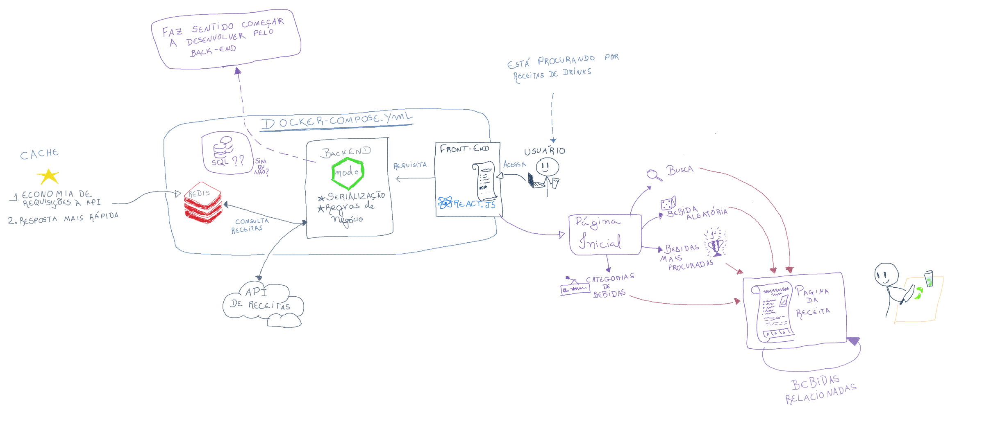
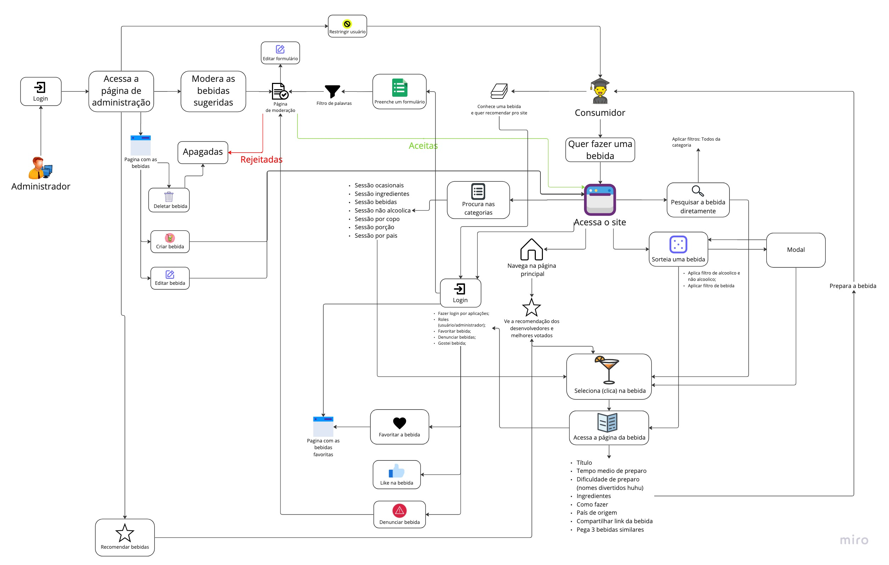

## Rich Picture

| Versão | Alterações | Responsável|
| ------ | ---------- | ---------- |
| 0.1.0  | Criação dos Rich Pictures | Gabriel Sabanai e Filipe Machado |
| 0.2.0  | Revisão e aperfeiçoamento | Gabriel Sabanai e Filipe Machado |
| 0.3.0  | Criação e escrita do documento | Gabriel Sabanai |

*Tabela 1: Versionamento*

O Rich Picture é um processo que visa, de forma descritiva e ilustrativa, ajudar o cliente a descrever o produto ou o sistema de software que tem em mente, junto com todas demandas internas ou externas do sistema. Esse artefato ajuda a abstrair de forma simples e entendivel os principais elementos do produto.

De forma mais clara, o Rich Picture consiste em ilustrar pontos principais da questão. Dessa forma, é possível descobrir os principais elemtos do artefato, sendo eles: Os **autores**, as **operações**, as **setas** e o **limite do sistema**.

Levando em conta tudo o que foi dito, os membros Gabriel Sabanai e Filipe Machado realizaram a construção de um Rich Picture, como é possível ver nas figuras 1 e 2, para o obter o melhor entendimento do projeto e melhor compreensão de sua estrutura.


*Figura 1: Rich Picture Tecnico*


*Figura 2: Rich Picture Produto*

Caso seja de interesse, logo abaixo se encontra o link do miro para visualizar o Rich Picture do produto:

Link: [Rich Picture Produto](https://miro.com/app/board/uXjVPCqpmcM=/?share_link_id=714016906764)

# Referências
[//]: # "TODO: alterar numeração e incluir referências"
>   ```
>  Requisitos de software 2022/1. Disponível em: https://requisitos-de-software.github.io/2022.1-Jitsi-Meet/preRastreabilidade/richPicture/
>   ```
