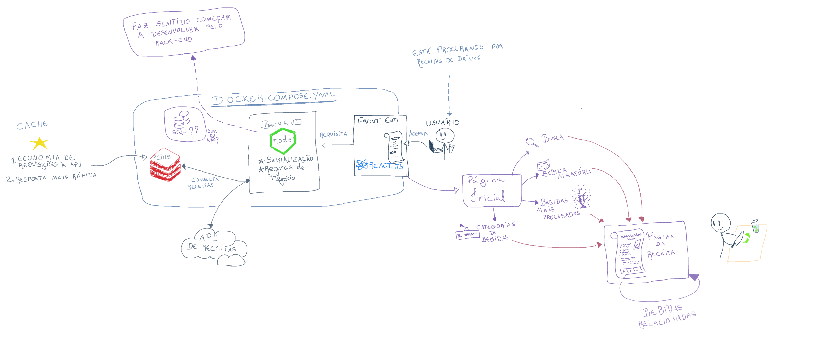
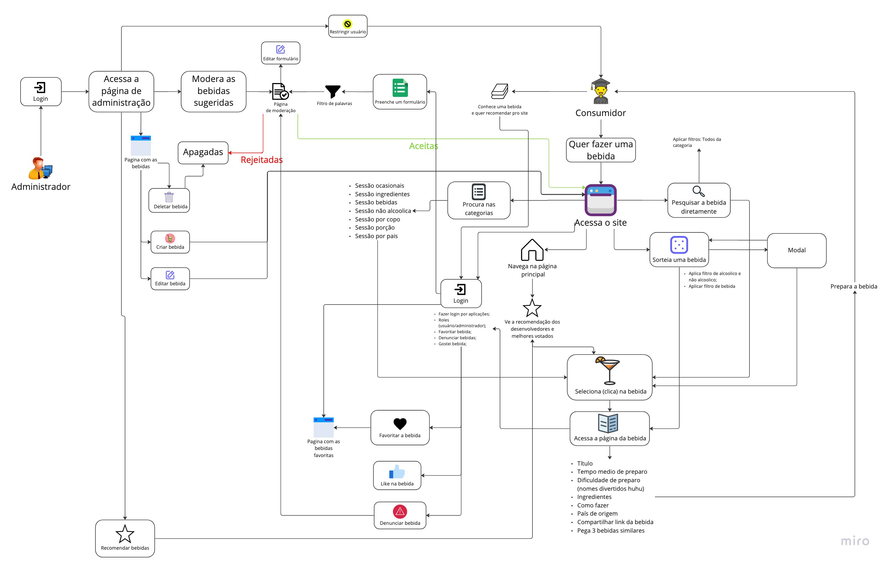

# 1.1. Módulo Projeto Não Orientado a Abordagens Específicas

# 1.1.1 Versionamento do Documento

| Versão | Alterações | Responsável|
| ------ | ---------- | ---------- |
| 0.1.0  | Criação da tabela de versionamento, contribuição e referências | Arthur Matos |
| 0.2.0  | Inclusão dos artefatos 5W2H iniciais | Arthur Matos |
| 0.3.0  | Inclusão do Rich Picture Inicial | Filipe Machado |
| 0.4.0  | Definição e Inclusão de Políticas de Commits e Branches | Filipe Machado, Arthur Matos, Paulo Henrique |
| 0.5.0 | Definição e inclusão do Rich Picture | Gabriel Sabanai |
| 0.6.0 | Definição e inclusão do Design Sprint | Gabriel Sabanai | 


## 1.1.2 5W2H

Para definição direta e com maior clareza do projeto, foram elaborados duas tabelas 5W2H. O artefato em questão tem o objetivo de estabelecer planos de ação eficientemente, mas também, pode ser empregado para a documentação objetíva sobre os principais aspectos de um projeto.


Sua estrutura é composta por uma série de perguntas diretas, advindas do inglês *"What? Why? Who? Where? When? How? How much?"* que buscam descrever os papeis e conceitos de uma determinada etapa de processo.


Para o contexto do projeto, foram gerados 2 destes artefatos, sendo estes referêntes a especificação do uso esperado da plataforma, bem como a ação geral da equipe ao longo do projeto.


*Figura 1: 5W2H Especificação de uso*


*Figura 2: 5W2H Definição geral da ação da equipe*

## 1.1.3 Rich Picture

O Rich Picture é um processo que visa, de forma descritiva e ilustrativa, ajudar o cliente a descrever o produto ou o sistema de software que tem em mente, junto com todas demandas internas ou externas do sistema. Esse artefato ajuda a abstrair de forma simples e entendivel os principais elementos do produto.

De forma mais clara, o Rich Picture consiste em ilustrar pontos principais da questão. Dessa forma, é possível descobrir os principais elemtos do artefato, sendo eles: Os **autores**, as **operações**, as **setas** e o **limite do sistema**.

Levando em conta tudo o que foi dito, os membros Gabriel Sabanai e Filipe Machado realizaram a construção de um Rich Picture, como é possível ver nas figuras 3 e 4, para o obter o melhor entendimento do projeto e melhor compreensão de sua estrutura.


*Figura 3: Rich Picture Tecnico*


*Figura 4: Rich Picture Produto*

Caso seja de interesse, logo abaixo se encontra o link do miro para visualizar o Rich Picture do produto:

Link: [Rich Picture Produto](https://miro.com/app/board/uXjVPCqpmcM=/?share_link_id=714016906764)

## 1.1.4 Design Sprint

O Design Sprint é um processo, desenvolvido pela Google Ventures, de 5 dias de trabalho que tem como objetivo responder as questões mais críticas do produto, por meio do design, prototipação e validações de ideias. Considerado um sucesso para formação estrategica, de inovação e de designt thinking de uma solução.

Como dito anteriormente é um trabalho contando 5 dias de duração, começando na segunda e terminando na sexta, no qual, cada um dos dias tem um trabalho especifico e fundamental para o andamento da sprint, como é possível observar na figura 5, anexada abaixo.


*Figura 5: Design Sprint*

Assim sendo, abaixo iremos descrever sobre cada um dos dias e o processo do time de elaboração do desgin sprint, vale ressaltar que a os processos não foram seguidos a risca devido o contexto dos membros da equipe.

### Segunda - Compreender
Nesse processo, o time irá vai compartilhar tudo que sabe sobre o projeto (problemas e ideias). Em seguida, é recomendado criar um mapa mental, para assim validarmos com aqueles que tem maior visão ou necessidade do projeto. Por fim, será elaborado um objetivo concreto do que iremos desenvolver ao longo da sprint.

Durante essa etapa, o grupo se juntou e realizou diversas operações que ajudassem a elicitar ideias e identificar problemas. Dessa forma, a equipe se juntou para realizar um brainstorm, fez a criação de dois mapas mentais e também de dois rich pictures.

### Terça - Divergir
É realizado uma revisão das idéias existentes, para a melhoria ou adição de alguma ideia. A ideia é cada um dos membros seguirem com um sketch e apresentarem para o grupo para ser revisado e decidido.

Nessa etapa, o grupo optou por fazer uma revisão tanto dos mapas mentais, brainstorms, e, principalemente, dos rich pictures, já que, assim, foi possível analisar e discutir todas as soluções propostas e conseguindo avaliar o que funcionava ou não.

### Quarta - Decidir
Durante essa fase, as soluções escolhidas da etapa anterior são lápidadas ao ponto de ser possível construi um plano solido. Assim sendo, cada um dos pontos levantados serão discutidos e definidos se entram no escopo ou não. Por fim, um storyboard é criado com o passo a passo do plano para o prototypo.

No decorrer desse estagio, o time repassou mais uma vez pelo o Rich Picture e refinou cada uma das soluções e funcionalidades do fluxo. Logo após, o próprio Rich Picture foi atualizado com as funcionalidades que foram decididas para entrar no escopo do produto, atuando assim como nosso storyboard.

### Quinta - Prototipação
Na quinta, a ideia é pegar o que foi elaborado no storyboard e criar um prototipo, pouco focado no design ou nas cores, mas realista o suficiente para as pessoas consigam compreende-lo. Além disso, será elaborado um questionario para que seja realizado um teste e validação com usuários.

Durante esse momento, priorizamos aplicar os conhecimentos adquiridos em IHC e em Requisitos, foi definido dividir o protótipo em "prototipos de baixa fidelidade" e depois em "prototipo de alta fidelidade". Assim sendo, foram criados alguns prototipos de baixa fidelidade para que conseguissimos levantar ideias para o design.

É possível visualizar nas figuras 6, 7 e 8 os modelos criados pelos membros João Victor Batista, Thiago Fraça e Gabriel Sabanai.

COLOCAR AS IMAGENS AQUI

### Sexta - Validação
Por fim, a ultima etapa é definida pela realização da testagem e validação das features dos prototipos por grupo de usuários selecionados pela equipe. O importante dessa etapa é acompanhar todo o fluxo de testagem do usuário teste e, assim, prestar atenção nas suas reações e realizar perguntas durante o processo.

Na ultima etapa, como a equipe decidiu acresentar a criação do prototipo de alta fidelidade, não foi possível realizar os testes e as validações ainda. Isso se deve por dois motivos, tanto pelo o processo de alta fidelidade não estar finalizado, já que envolve a finalização de processos de design mais complexos, como pelo contexto da equipe e o tempo necessário para realizar um processo de qualidade.
 
# 1.1.X Referências
[//]: # "TODO: alterar numeração e incluir referências"
>   ```
>   {Autores}. Disponível em: {Inserir}. Acesso em: {Inserir}
>   Requisitos de software 2022/1. Disponível em: https://requisitos-de-software.github.io/2022.1-Jitsi-Meet/preRastreabilidade/richPicture/
>   ```

```
Estudar o domínio de aplicações similares, e realizar Design Sprint para levantamento dos principais artefatos e requisitos.

Foco_1: Técnicas de Elicitação, Artefatos Independentes de Metodologia e Esboço da Baseline de Requisitos (Priorizada)

Entrega Mínina: Design Sprint, 5W2H, Mapa Mental, Diagrama Causa-Efeito, Rich Picture, Léxico (ou Glossário) e Planos de Risco, Custo e Tempo.

Apresentação (em sala) explicando passo a passo a Design Sprint realizada, com: (i) rastro claro aos membros participantes; (ii) justificativas & senso crítico sobre o trabalho realizado; (iii) breve apresentação dos artefatos
elaborados, e (iv) comentários gerais sobre iniciativas extras. Tempo da Apresentação: +/- 10min. Recomendação: Apresentar diretamente via Wiki ou GitPages do Projeto.

A Wiki ou GitPages do Projeto deve conter um tópico dedicado ao Módulo Projeto Não Orientado a Abordagens Específicas, com artefatos, histórico de versões, referências, e demais detalhamentos gerados pela equipe nesse escopo.

Demais orientações disponíveis nas Diretrizes (vide Moodle).
```
