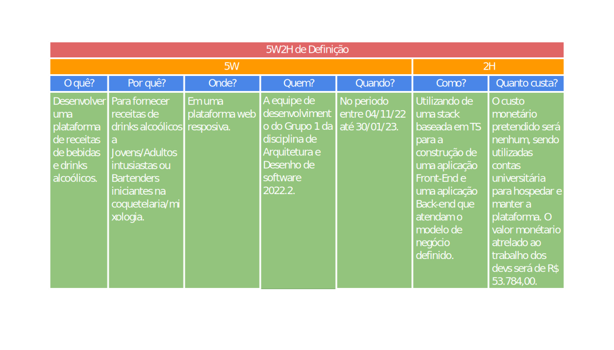

# 1.1. Módulo Projeto Não Orientado a Abordagens Específicas

# 1.1.1 Versionamento do Documento

| Versão | Alterações | Responsável|
| ------ | ---------- | ---------- |
| 0.1.0  | Criação da tabela de versionamento, contribuição e referências | Arthur Matos |
| 0.2.0  | Inclusão dos artefatos 5W2H iniciais | Arthur Matos |
| 0.3.0  | Inclusão do Rich Picture Inicial | Filipe Machado |
| 0.4.0  | Definição e Inclusão de Políticas de Commits e Branches | Filipe Machado, Arthur Matos, Paulo Henrique |


## 5W2H

Para definição direta e com maior clareza do projeto, foram elaborados duas tabelas 5W2H. O artefato em questão tem o objetivo de estabelecer planos de ação eficientemente, mas também, pode ser empregado para a documentação objetíva sobre os principais aspectos de um projeto.


Sua estrutura é composta por uma série de perguntas diretas, advindas do inglês *"What? Why? Who? Where? When? How? How much?"* que buscam descrever os papeis e conceitos de uma determinada etapa de processo.


Para o contexto do projeto, foram gerados 2 destes artefatos, sendo estes referêntes a especificação do uso esperado da plataforma, bem como a ação geral da equipe ao longo do projeto.


*5W2H: Especificação de uso*



*5W2H: Definição geral da ação da equipe*

# 1.1.X Referências
[//]: # "TODO: alterar numeração e incluir referências"
>   ```
>   {Autores}. Disponível em: {Inserir}. Acesso em: {Inserir}
>
>   ```

```
Estudar o domínio de aplicações similares, e realizar Design Sprint para levantamento dos principais artefatos e requisitos.

Foco_1: Técnicas de Elicitação, Artefatos Independentes de Metodologia e Esboço da Baseline de Requisitos (Priorizada)

Entrega Mínina: Design Sprint, 5W2H, Mapa Mental, Diagrama Causa-Efeito, Rich Picture, Léxico (ou Glossário) e Planos de Risco, Custo e Tempo.

Apresentação (em sala) explicando passo a passo a Design Sprint realizada, com: (i) rastro claro aos membros participantes; (ii) justificativas & senso crítico sobre o trabalho realizado; (iii) breve apresentação dos artefatos
elaborados, e (iv) comentários gerais sobre iniciativas extras. Tempo da Apresentação: +/- 10min. Recomendação: Apresentar diretamente via Wiki ou GitPages do Projeto.

A Wiki ou GitPages do Projeto deve conter um tópico dedicado ao Módulo Projeto Não Orientado a Abordagens Específicas, com artefatos, histórico de versões, referências, e demais detalhamentos gerados pela equipe nesse escopo.

Demais orientações disponíveis nas Diretrizes (vide Moodle).
```
