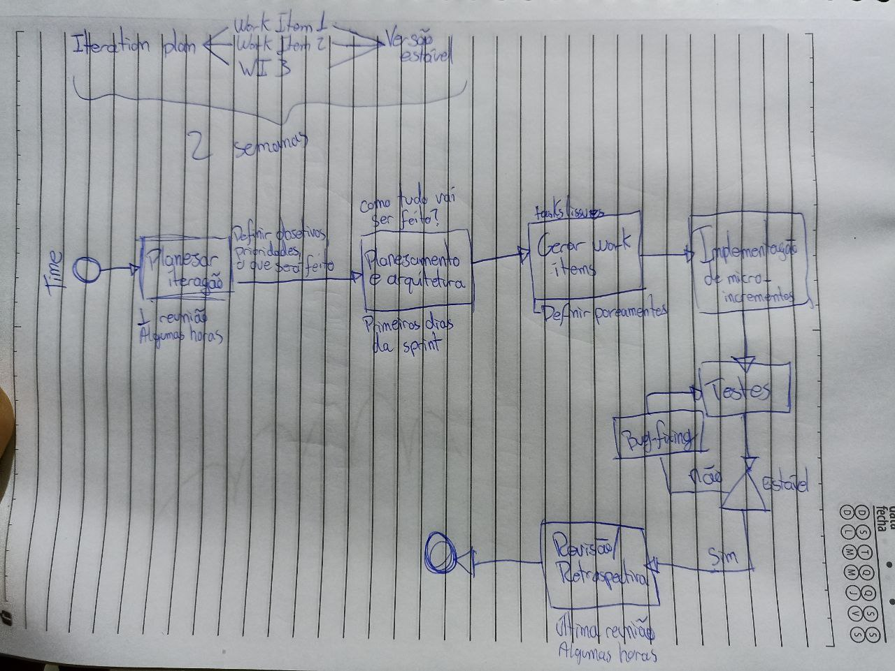
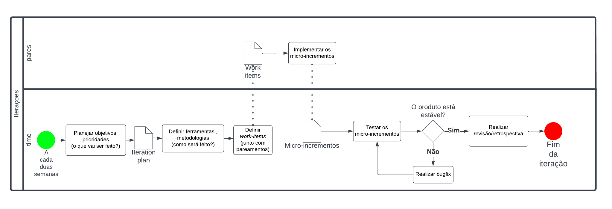

# BPMN

Versionamento

versão | data | Modificação | Autor
-------|------|-------------|------
0.1.0 | 17/11/2022 | Criação do documento | Ciro Costa
0.2.0 | 17/11/2022 | Inserção do BPMN | Ciro Costa e Artur de Sousa
0.3.0 | 17/11/2022 | Correção do BPMN e adição de processo de criação| Artur de Sousa

*Tabela 1: Versionamento*

## Introdução

O BPMN é uma representação gráfica dos processos e seus fluxos, por meio de icones para facilitar o entendimento do usuário.

O nosso BPMN representa os processos que ocorrem na parte que gente considera mais crucial do Open up, as interações.

## Artefatos obtidos

Os artefatos que foram desenvolvidos para essa etapa foram:

- Idealização em Papel
- BPMN Final

### Idealização em Papel

Primeiramente, o Membro Samuel Avila mapeou a metodologia da Iteration Plan que o grupo iria utilizar, considerando que era a etapa do OpenUp que o grupo usaria mais.

Já nesta etapa também foi definido como as duplas seriam utilizadas na metodologia, que seria o desenvolvimento das micro-implementações.

*Figura 1: Rascunho BPMN* 

### BPMN Final

Utilizando como base a idealização em papel, utilizando da plataforma [LucidChart](https://www.lucidchart.com/pages/pt) foi desenvolvido o BPMN final na digitalmente.

*Figura 2: BPMN* 

## Referências

[1] SERRANO, Milene. [DSW-Base - BPMN](https://aprender3.unb.br/pluginfile.php/2277114/mod_label/intro/Arquitetura%20e%20Desenho%20de%20software%20-%20Aula%20BPMN%20Exemplos%20-%20Profa.%20Milene.pdf). Material apresentado para a disciplina de Arquitetura e Desenho de Software no curso de Engenharia de Software da UnB, FGA. Acesso em: 18 de novembro de 2022.