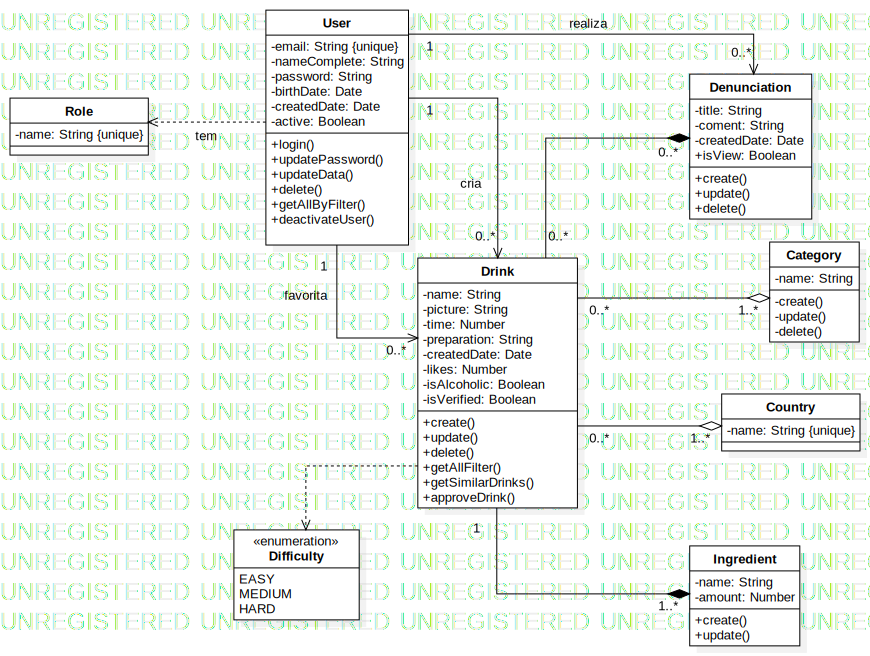

# Diagrama de Classes

## Versionamento

versão | data | Modificação | Autor
-------|------|-------------|------
0.0.1 | 03/12/2022 | Criação do Diagrama de Classes | Alan
0.0.2 | 04/12/2022 | Revisão e correção do Diagrama de Classes | Alan e Samuel
0.1.0 | 05/12/2022 | Criação da documentação | Samuel
0.1.0 | 05/12/2022 | Atualização do Diagrama de Classes | Samuel e Alan

*Tabela 1: Versionamento*

## Introdução

O diagrama de classes é um artefato essencial para compreender como o projeto será implementado. Nesse diagrama, é possível ver de forma clara o que cada classe fará (seus atributos e métodos) e como se relacionará com as demais.

## Metodologia

Utilizando a Linguagem de Modelagem Unificada, foi elaborado o Diagrama de Classe do Copo Cheio. O artefato mais utilizado como referência inicial foi o [Rich Picture](./../Base/1.1.7.RichPicture.md), a partir dele tivemos toda a base para saber a base do diagrama. Além disso, outros artefatos muito importantes para continuar estruturando o Diagrama de Classes foram: o Backlog e o Diagrama de Sequência. A ferramenta utilizada para criação do Diagrama foi o StarUML e essa é a versão mais atual:

*Figura 1: Versão 1.2 do Diagrama de Classe feito com StarUML* 

## Versões anteriores

*Figura 2: Versão 1.0 d0 Diagrama de Classe feito com StarUML* 