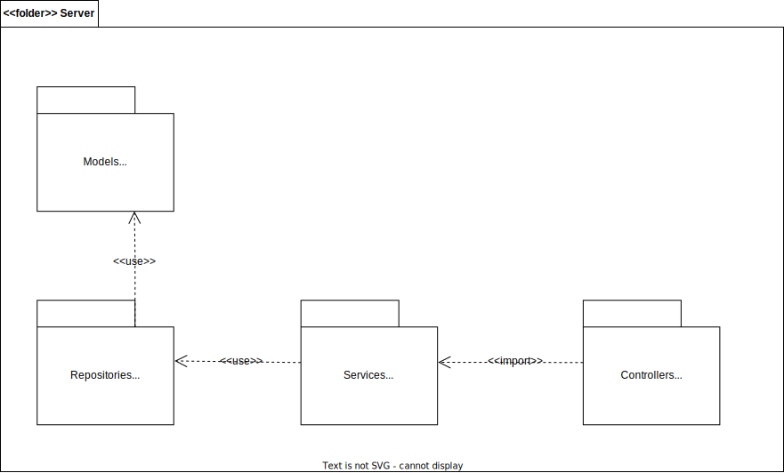

# Diagrama de Pacotes

Versionamento

versão | data | Modificação | Autor
-------|------|-------------|------
0.1.0 | 03/12/2022 | Criação do documento | Arthur Matos
0.2.0 | 30/01/2023 | Atualização do diagrama de server | Arthur Matos

*Tabela 1: Versionamento*

## Introdução

_O que é um pacote?_

De acordo com a documentação da [IBM](https://www.ibm.com/docs/pt-br/rational-soft-arch/9.7.0?topic=diagrams-packages), um pacote pode ser definido como uma estrutura que agrupa elementos de modelos relacionados de todos os tipos. Tais pacotes podem agrupar elementos pelos seguintes motivos:

> Organizar os elementos de modelo para que o modelo seja mais fácil de entender e de navegar no Explorador de Projetos.

> Modelar a arquitetura do sistema utilizando pacotes para representar as diversas camadas ou subsistemas.

_O que é um diagrama de pacotes?_

"Os diagramas de pacotes consistem em diagramas estruturais usados para mostrar, em uma forma de pacotes, a organização e disposição de vários elementos de modelos". ([lucidchart](https://www.lucidchart.com/pages/pt/diagrama-de-pacotes-uml))

### Metodologia

Para o contexto do projeto os diagramas desenvolvidos buscam estabelecer as camadas de responsabilidade das estruturas de pacotes/arquivos dentro da arquitetura Client - Server escolhida para ser utilizada dentro do projeto. Por isso foram especificados os elementos referentes a ambas as representações da aplicação de client, bem como a aplicação server.

#### Diagrama estrutura Server

Na estrutura descrita pelo server temos 4 pacotes que representam niveis de responsabilidade. Os niveis descrtos são:

Models: Os arquivos presentes no pacote representão uma abstação das entidades do sistema, sendo essas utilizadas pela camada de repository.

Middlewares: Os Middlewares representam uma camada extra às controller que injetam um comportamento nas chamadas. São utilizadas para o tratamento geral de excessões da aplicação Server, bem como a autenticação de rotas.

DTO: Os Data transfer objects são objetos que carregam dados entre processos para facilitar a comunicação. São utilizados pelos services para facilitar a comunicação com os dados recebidos pela controller do Client.

Services: Os arquivos referentes ao pacote de services representam a camada de negócio da aplicação server. O tratamento de dados, bem como a aplicação das regras sobres de acordo as requisições feitas a aplicação são tratadas nesta camada.

Controllers: A camada de controller tem a responsabilidade única de estabelecer a comunicação da aplicação server para com aplicações exteriores através do protocolo HTTP.

_Figura 1: Diagrama de pacotes Server_

_Autoria Própria_

#### Diagrama estrutura Client

Para a estrutura descrita para o client, foram estabelecidas as convenções de organização dos componentes de estilização e comunicação para com a aplicação de servidor. Os pacotes foram definidos da seguinte forma:

Components: Responsável pelo armazenamento de componentes reutilizáveis ao longo da construção das telas da aplicação Client.

Pages: Responsável pelo armazenamento de cada estrutura de tela presente na aplicação Client

Assets: Responsável pelo armazenamento de arquivos estáticos de imagens ou ícones.

Routes: Responsável pela estruturação das rotas da aplicação visíveis ao usuário

Services: Responsável pela comunicação com a aplicação Server e eventuais outras aplicações externas via protocolo http. 

_Figura 2: Diagrama de pacotes Client_

_Autoria Própria_

#### Diagrama estrutura Aplicação

Por fim a estrutura total da aplicação cliente-servidor se dá pelo seguinte modelo:

_Figura 3: Diagrama de pacotes Aplicação_

_Autoria Própria_

## Referências

> Pacotes. Disponível em: <https://www.ibm.com/docs/pt-br/rational-soft-arch/9.7.0?topic=diagrams-packages>. Acesso em: 3 dez. 2022.
>
> Tutorial sobre diagramas de pacotes UML. Disponível em: <https://www.lucidchart.com/pages/pt/diagrama-de-pacotes-uml>.