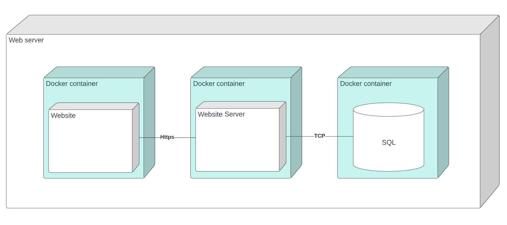

# Diagrama de implementação

## Versionamento

versão | data | Modificação | Autor
-------|------|-------------|------
0.1.0 | 25/11/2022 | Criação do documento | Ciro

*Tabela 1: Versionamento*

## Introdução

O diagrama de implementação é um diagrama utilizado para representar a relação entre os componentes de software e hardware e suas dependências.

*Figura 1: Diagrama de implementação em webserver* 