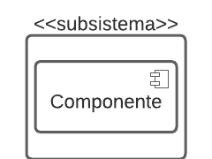

# Diagrama de Componentes

Versionamento

versão | data | Modificação | Autor
-------|------|-------------|------
0.1.0 | 05/12/2022 | Criação do diagrama| Gabriel Sabanai
0.1.1 | 05/12/2022 | Criação do documento| Arthur Matos

*Tabela 1: Versionamento*

## Introdução

O diagrama de componentes é um diagrama criado com o intuito de elencar o relacionamento entre os diferentes componentes presentes dentro de um sistema. Dessa forma, o termo "componente" representa um módulo de classes que essas representam sistemas ou subsistemas independentes capazes de interagir entre sí e com o restante do sistema.

Adicionar um diagrama de componentes dentro de uma documentação, traz alguns benéficios para o desenvolvimento, sendo eles:

* Possível imaginar a estrutura do sistema;
* Maior atenção aos componentes do sistema e como se relacionam;
* Enfatizam como um serviço se comporta de acordo com uma interface.

## Metodologia

Para criar o diagrama foi utilizado a abordagem de Desenvolvimento Baseado em Componentes (CBD) proposto pelo Lucidchart. Com ela conseguimos identificar os diferente componentes presente no sistema para que o mesmo funcione corretamente.

Assim sendo, o integrante Gabriel Sabanai, com os conhecimentos adquiridos na sala de aula e na leitura de artigos, construiu o Diagrama de Componentes da aplicação Copo Cheio, utilizando a ferramenta Lucidchart. É posível ver o diagrama na figura 1 representada abaixo.

*Figura 1: Diagrama de Componentes*

### Legendas

Simbolo | Nome | Descrição
--------|------|----------
 | Componente | O componente fornece e consome comportamento em interfaces ou por meio de outros componentes.
 | Símbolo de Dependencia | Mostra que uma parte do sistema depende de outra.
 | Símbolo de Interface | Interface representante do componente
 | Símbolo Integração Interface | Simbolo que conecta com uma interface
 | Subsistema | Representação do subsistema 

## Referencia

> Diagrama de componentes UML: o que é, como fazer e exemplos. Lucidchart. Disponível em: https://www.lucidchart.com/pages/pt/diagrama-de-componentes-uml. Acesso dia 05 de dezembro de 2022

> UML Tutorial: How to Draw UML Component Diagram. Disponível em: https://www.youtube.com/watch?v=_iiOOxIDrGA. Acesso dia 05 de dezembro de 2022.
