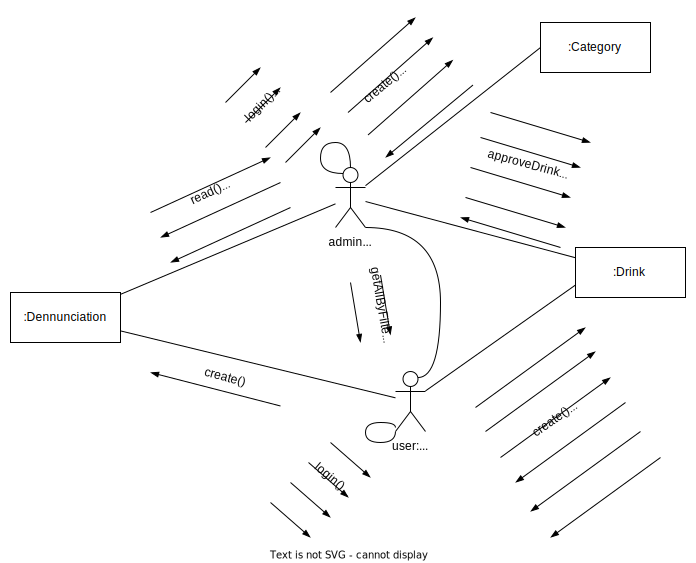

# Diagrama de comunicação

Versionamento

versão | data | Modificação | Autor
-------|------|-------------|------
0.1.0 | 05/12/2022 | Criação do documento | Leonardo Takehana

*Tabela 1: Versionamento*

## Introdução

O diagrama de comunicação é um diagrama utilizado para representar a relação entre os objetos através de suas interações.

Ele é composto por principalmente 4 elementos:

* Quadros de Interação: Um quadro de interação fornece um contexto ou limite para o diagrama no qual os elementos podem ser criados como linhas de vida ou mensagens;
* Linhas de Vida em Diagramas UML: Linhas de vida representam os objetos que irão participar de uma interação, cada instancia em uma interação é representada por uma linha de vida;
* Caminhos de Mensagens nos Diagramas de Comunicação: Caminho de mensagem conecta funções ou objetos representados pelas linhas de vida, o caminho identifica os objetos que podem transmitir as mensagens dentro da interação;
* Mensagens em Diagramas UML: Mensagens na UML são elementos que definem um tipo específico de comunicação entre instancias, dentro de uma interação, transportando informações entre uma linha de vida para outra instancia.

## Diagrama

*Figura 1: Diagrama de Comunicaçao da plataforma Copo Cheio* 

## Referências

SERRANO, Milene. Diagrama de Colaboração, 2022. Material apresentado na Disciplina de Arquitetura e Desenho de Software do curso de engenharia de software da UnB, FGA. Acesso em: 04 dez. 2022.

UML DIAGRAMS. UML Communication Diagrams Overview. Disponível em: https://www.uml-diagrams.org/communication-diagrams.html. Acesso em: 04 dez. 2022.

Rational Software Architect RealTime Edition. Criando Diagramas de Comunicação. Disponível em: https://www.ibm.com/docs/pt-br/rsar/9.5?topic=diagrams-creating-communication.   Acesso em: 04 dez. 2022.

Rational Software Architect RealTime Edition. Diagramas de Comunicação. Disponível em: https://www.ibm.com/docs/pt-br/rsar/9.5?topic=diagrams-communication.   Acesso em: 04 dez. 2022.

