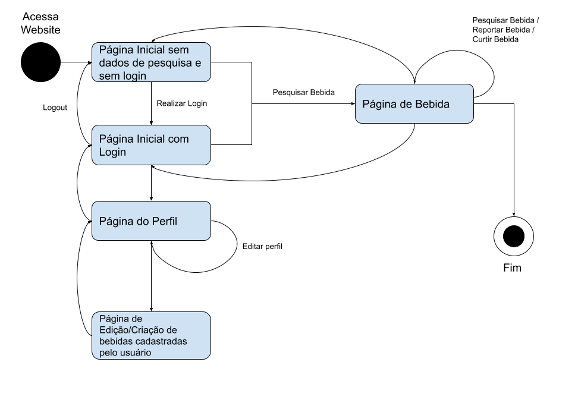

# 2.1.2.1 Diagrama de estados

Versionamento

versão | data | Modificação | Autor
-------|------|-------------|------
0.1.0 | 04/12/2022 | Criação do documento | Filipe Machado
0.1.1 | 05/12/2022 | Atualização da página inicial | Filipe Machado

*Tabela 1: Versionamento*

## Introdução

O diagrama de estados é um diagrama utilizado para representar os estados em 
que o sistema se apresenta. Esse diagrama ajuda a entender visualmente, em complementação aos diagramas estáticos, os estados que o sistema apresenta de acordo com a interação do usuário. Esse diagrama de estados não representa completamente os estados que o sistema se encontra pois é necessário abstrair algumas relações entre os estados para evitar poluição visual desnecessária, como por exemplo que em todos os estados, é possível voltar para a página inicial, e se isso fosse representado no diagrama somente iria criar ruído.

Podemos observar que o primeiro estado que o sistema se encontra é a página inicial onde usuário pode estar ou não estar autenticado no sistema.

A partir da página inicial, o usuário poderá realizar uma busca por bebidas, e assim que tiver realizado a busca, ele poderá acessar a página de receita da mesma.

Na página de bebida o usuário poderá pesquisar bebida, reportar uma bebida, comentar sobre a bebida e sinalizar a curtida da receita de uma bebida.

Se o usuário estiver autenticado no sistema ele pode seguir para a página do perfil onde ele poderá gerenciar o próprio perfil ou gerenciar bebidas criadas por ele.

*Figura 1: Diagrama de estados* 
