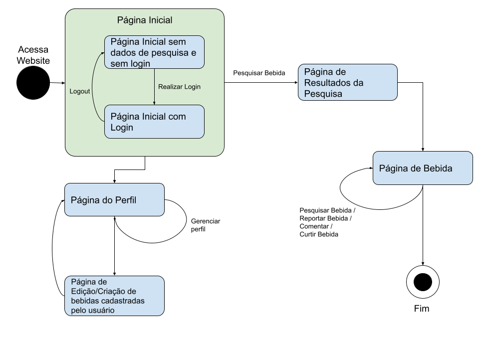

# 2.1.2.1 Diagrama de estados

Versionamento

versão | data | Modificação | Autor
-------|------|-------------|------
0.1.0 | 04/12/2022 | Criação do documento | Filipe Machado
0.1.1 | 05/12/2022 | Atualização da página inicial | Filipe Machado

*Tabela 1: Versionamento*

## Introdução

O diagrama de estados é um diagrama utilizado para representar os estados em 
que o sistema se apresenta.

*Figura 1: Diagrama de estados* 