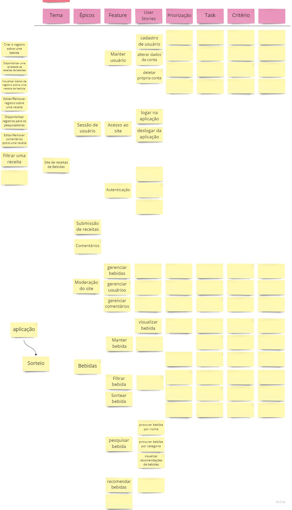

# Backlog do Produto

## Versionamento

| versão | data       | Modificação                   | Autor                                                                  |
|--------|------------|-------------------------------|------------------------------------------------------------------------|
| 0.1.0  | 03/12/2022 | Criação do documento          | João Victor Batista, Paulo Henrique Rezende, Artur Sousa, Lucas Soares |
| 0.2.0  | 03/12/2022 | Correções no backlog          | João Victor Batista                                                    |
| 0.3.0  | 03/12/2022 | Introdução do backlog         | Paulo Henrique                                                         |
| 0.4.0  | 03/12/2022 | O que é o Método MoSCoW       | Lucas Soares                                                           |
| 0.5.0  | 05/12/2022 | Metodologia do backlog        | João Victor Batista                                                    |
| 0.5.1  | 05/12/2022 | Correção textual e estrutural | Artur de Sousa                                                         |
| 0.6.0  | 05/12/2022 | Adicionar rascunho do backlog | Artur de Sousa                                                         |

*Tabela 1: Versionamento*

## Introdução

### O que é o Product Backlog?

Product Backlog é uma artefato muito usado por gerentes de projetos que usam a metodologia SCRUM para desenvoler um produto de software, ele é um dos artefatos obtido nesta metodologia. Portanto, o product backlog é uma lista de atividades que é documentado a partir do requisitos levantados no início de todo projeto.

Essas listas de atividades, mais conhecidos como tasks, são construídas inicialmente em grandes épicos, em seguida em features que se entende como épicos menores e depois em história de usuários, ou seja, o backlog do produto nada mais é que pequenas tarefas levantadas pelo P.O (Product Owner) que levam a construir um produto que satisfaça as necessidades do cliente, vale fazer uma pequena ressalva de que o Product Backlog não é algo constante este artefato pode ser editado em qualquer momento do desenvolvimento, pois é muito difícil econtrarmos clientes que não peçam alterações no projeto e que o P.O não encontre algo que possa ser melhorado.

Contudo, uma das granularizações que será abordada, além das citadas acima, será a priozação baseada na técnica chamada MoSCoW, sendo assim, com esta técnica iremos priorizar nossa histórias de usários.

### O que é o Método MoSCoW?

O **Método MoSCoW** é uma técnica utilizada em gestão, análise de negócios, desenvolvimento de software e gerenciamentos de projetos. Ela é utilizada para definir a prioridade e a importância das tarefas que compõem um projeto.

A Técnica MoSCoW foi criada por Dai Clegg, enquanto ele desenvolvia seus trabalhos na Oracle, nos anos 90. Além disso, essa técnica foi criada para dar suporte ao método chamado DSDM, também conhecido como Metodologia de desenvolvimento de sistemas dinâmicos.

Por isso, dizemos que esse método tem origem nas metodologias ágeis, visto que a DSDM faz parte desses frameworks. Atualmente, a DSDM Consortium tem a propriedade intelectual da técnica.

Fazer uso dessa técnica permite que todos stakeholders e membros do time acordem numa ordem de importância. Assim, as expectativas são ajustadas ao que será entregue como **Mínimo Produto Viável (MVP)** e quais atividades serão entregues posteriormente ou, até mesmo, que deixarão de ser entregues.

A ideia que baseia esse método é o timeboxing, isto é, os projetos ágeis possuem um timeboxing para serem realizados e as atividades a serem realizadas devem caber neste espaço de tempo determinado. Dessa forma, é preciso escolher o que precisa ser feito para fazer uma entrega de valor.

## Metodologia

O backlog foi construído modelando e agrupando os requisitos do projeto em diferentes níveis de granularidade: as Histórias de Usuário, representativas dos requisitos que geram valor ao produto, foram agrupadas em Features, ou seja, as funcionalidades propriamente ditas do sistema, que por sua vez foram agrupadas em Épicos, conjunto de funcionalidades que possuem objetivo ou resultado comum específico.

## Artefatos obtidos

Inicialmente, após estudo dos artefatos obtidos na sprint anterior, principalmente o Mapa Mental e o Rich Picture,
os membros responsáveis pelo backlog se reuniram para fazer o brainstorm do backlog, feito na plataforma *Miro*.

*Figura 1: Brainstorm do backlog*

Em seguida, quando se tenha uma boa ideia do que seria o baklog, ele foi passado para uma tabela, visto que
tem uma mehor visibilidade da rastreabilidade e é mais formal.

### Backlog do site das bebidas
 

<table>
<!-- HEADER -->
 <tr>
    <th>Épicos</th>
    <th>Features</th>
    <th>User Stories</th>
    <th>Priorização</th>
    <th>Pontuação</th>
 </tr>

 <tr>
    <td rowspan="7">E01 - Sessão de Usuário</td>
    <td rowspan="4">F01 - Manter usuário</td>
    <td>US01 - Eu, como usuário, gostaria de cadastrar na plataforma, para que posso acessar mais funcionalidades</td>
    <td>M</td>
    <td>XX</td>
 </tr>

 <tr>
    <td>US02 - Eu, como usuário, gostaria de visualizar minha conta, para que posso consultar minhas informações</td>
    <td>M</td>
    <td>XX</td>
 </tr>

  <tr>
    <td>US03 - Eu, como usuário, gostaria de alterar dados da minha conta, para que possa deixar minhas informações atualizadas</td>
    <td>S</td>
    <td>XX</td>
 </tr>

  <tr>
    <td>US04 - Eu, como usuário, gostaria de deletar minha conta, para que possa me desvincular da plataforma</td>
    <td>S</td>
    <td>XX</td>
 </tr>

  <tr>
    <td rowspan="2">F02 - Autenticar usuário</td>
    <td>US05 - Eu, como usuário, gostaria de autenticar com login e senha, para que acessar minha conta</td>
    <td>M</td>
    <td>XX</td>
 </tr>

  <tr>
    <td>US06 - Eu, como usuário, gostaria de utilizar uma conta existente de outra rede social, para que me cadastrar e acessar a plataforma</td>
    <td>C</td>
    <td>XX</td>
 </tr>

  <tr>
    <td rowspan="1">F03 - Logout</td>
    <td>US07 - Eu, como usuário, gostaria efetuar logout, para que possa sair da minha conta</td>
    <td>M</td>
    <td>XX</td>
 </tr>

  <tr>
    <td rowspan="5">E02 - Moderação da plataforma</td>
    <td rowspan="3">F04 - Gerenciar bebidas</td>
    <td>US08 - Eu, como moderador, gostaria de deletar bebidas cadastradas, para que ela não esteja mais na aplicação</td>
    <td>M</td>
    <td>XX</td>
 </tr>

 <tr>
    <td>US09 - Eu, como moderador, gostaria de editar bebidas, para que possa mudar qualquer informação equivocada ou desatualizada</td>
    <td>S</td>
    <td>XX</td>
 </tr>
  <tr>
    <td>US10 - Eu, como moderador, gostaria de aprovar ou reprovar bebidas submetidas, para que possa ter receitas de usuários na plataforma</td>
    <td>M</td>
    <td>XX</td>
 </tr>

  <tr>
    <td rowspan="1">F05 - Gerenciar usuários</td>
    <td>US11 - Eu, como moderador, gostaria de restringir usuários, para que possa tirar de circulação do site, usuários que fogem dos termos de serviço</td>
    <td>C</td>
    <td>XX</td>
 </tr>

  <tr>
    <td rowspan="1">F06 - Gerenciar comentários</td>
    <td>US12 - Eu, como moderador, gostaria de deletar comentários, para que possa tirar de site comentários que fogem do termo de serviço</td>
    <td>S</td>
    <td>XX</td>
 </tr>

  <tr>
    <td rowspan="6">E03 - Comentários</td>
    <td rowspan="4">F07 - Manter comentários</td>
    <td>US13 - Eu, como usuário, desejo cadastrar um comentário á repeito de alguma bebida, a fim de avaliar quão bom é a receita da bebida</td>
    <td>S</td>
    <td>XX</td>
 </tr>

 <tr>
    <td>US14 - Eu, como usuário, desejo vizualizar os comentários á repeito de alguma bebida, a fim de saber a qualidade daquela receita</td>
    <td>S</td>
    <td>XX</td>
 </tr>

  <tr>
    <td>US15 - Eu, como usuário, desejo atualizar os comentários que eu cadastrei á respeito de alguma bebida, a fim de arrumar algo que escrevi errado</td>
    <td>S</td>
    <td>XX</td>
 </tr>

  <tr>
    <td>US16 - Eu, como usuário, desjo deletar meus comentários, a fim de não exibí-los na plataforma</td>
    <td>S</td>
    <td>XX</td>
 </tr>

  <tr>
    <td rowspan="2">F08 - Interagir com comentário</td>
    <td>US17 - Eu, como usuário, desejo cadastrar uma resposta à respeito de outro comentário já cadastrado, a fim de melhorar ajudar o usuário do comentário</td>
    <td>S</td>
    <td>XX</td>
 </tr>

  <tr>
    <td>US18 - Eu, como usuário, desejo reagir à algum comentário postado à respeito de alguma bebida, a fim de avaliar o quão é a receita postada</td>
    <td>M</td>
    <td>XX</td>
 </tr>

 <tr>
    <td rowspan="13">E04 - Bebidas</td>
    <td rowspan="4">F09 - Manter bebida</td>
    <td>US19 - Eu, como usuário, desejo criar uma receita de bebida</td>
    <td>M</td>
    <td>XX</td>
 </tr>

 <tr>
    <td>US20 - Eu, como usuário, desejo vizualizar as informações de uma bebida</td>
    <td>M</td>
    <td>XX</td>
 </tr>

  <tr>
    <td>US21 - Eu, como administrador, desejo editar as informações de bebidas cadastradas</td>
    <td>M</td>
    <td>XX</td>
 </tr>

  <tr>
    <td>US22 - Eu, como administrador, desejo deletar uma bebida cadastrada</td>
    <td>M</td>
    <td>XX</td>
 </tr>

  <tr>
    <td rowspan="3">F10 - Procurar bebida</td>
    <td>US23 - Eu, como usuário, desejo pesquisar por uma bebida através de seu nome, para encontrá-la mais rápido</td>
    <td>S</td>
    <td>XX</td>
 </tr>

  <tr>
    <td>US24 - Eu, como usuário, desejo filtrar as bebidas com base em categoria, ingredientes e/ou popularidade, para encontrá-las mais rápido</td>
    <td>C</td>
    <td>XX</td>
 </tr>

  <tr>
    <td>US25 - Eu, como usuário, desejo ordenar a visualização de bebidas por ordem alfabética ou de popularidade, para encontrá-las mais rápido</td>
    <td>C</td>
    <td>XX</td>
 </tr>

  <tr>
    <td rowspan="3">F11 - Interagir com bebida</td>
    <td>US26 - Eu, como usuário, desejo poder curtir uma bebida, para ajudar a realçá-la na plataforma</td>
    <td>S</td>
    <td>XX</td>
 </tr>

  <tr>
    <td>US27 - Eu, como usuário, desejo poder favoritar uma bebida, para poder encontrá-la mais rapidamente no futuro</td>
    <td>S</td>
    <td>XX</td>
  </tr>

  <tr>
    <td>US28 - Eu, como usuário, desejo poder denunciar uma bebida, para alertar a plataforma de uma possível ofensa nas informações da bebida</td>
    <td>M</td>
    <td>XX</td>
  </tr>

  <tr>
    <td rowspan="2">F12 - Sortear bebida</td>
    <td>US29 - Eu, como usuário, desejo sortear uma bebida aleatória, para encontrar receitas sem procurá-las</td>
    <td>M</td>
    <td>XX</td>
 </tr>

  <tr>
    <td>US30 - Eu, como usuário, desejo filtrar o sorteio de uma bebida, para limitar os possíveis resutados</td>
    <td>S</td>
    <td>XX</td>
  </tr>

  <tr>
    <td rowspan="1">F13 - Submeter bebida</td>
    <td>US31 - Eu, como usuário, desejo submeter uma receita de bebida para a plataforma, a fim de ter minhas receitas publicadas no site</td>
    <td>M</td>
    <td>XX</td>
 </tr>
</table>

*Tabela 2: Backlog do Produto*

 
 
 

### Backlog do site de administração
 

<table>
<!-- HEADER -->
 <tr>
    <th>Épicos</th>
    <th>Features</th>
    <th>User Stories</th>
    <th>Priorização</th>
    <th>Pontuação</th>
 </tr>

 <tr>
    <td rowspan="6">E01 - Sessão de Usuário Administrador</td>
    <td rowspan="4">F01 - Acessar conta</td>
    <td>US01 - Eu, como usuário administrador, gostaria de me cadastrar e enviar solicitação de confirmação de cadasto, para que eu possa gerenciar a aplicação de receitas</td>
    <td>M</td>
    <td>XX</td>
 </tr>

 <tr>
    <td>US02 - Eu, como usuário administrador, gostaria de visualizar minha conta, para que posso consultar minhas informações</td>
    <td>M</td>
    <td>XX</td>
 </tr>

  <tr>
    <td>US03 - Eu, como usuário administrador, gostaria de alterar dados da minha conta, para que possa deixar minhas informações atualizadas</td>
    <td>S</td>
    <td>XX</td>
 </tr>

  <tr>
    <td>US04 - Eu, como usuário administrador, gostaria de deletar minha conta, para que possa me desvincular da plataforma</td>
    <td>S</td>
    <td>XX</td>
 </tr>

  <tr>
    <td rowspan="1">F02 - Autenticar usuário</td>
    <td>US05 - Eu, como usuário administrador, gostaria de autenticar com login e senha, para que eu possa acessar minha conta</td>
    <td>M</td>
    <td>XX</td>
 </tr>

  <tr>
    <td rowspan="1">F03 - Logout do administrador</td>
    <td>US06 - Eu, como usuário administrador, gostaria de efetuar logout, para que possa sair da minha conta</td>
    <td>M</td>
    <td>XX</td>
 </tr>

 <tr>
    <td rowspan="3">E02 - Consulta</td>
    <td rowspan="3">F04 - Pesquisar bebida</td>
    <td>US07 - Eu, como usuário administrador, gostaria de pesquisar alguma bebida da plataforma, para que posso acessar todas suas informações</td>
    <td>M</td>
    <td>XX</td>
 </tr>

 <tr>
    <td>US08 - Eu, como usuário administrador, gostaria de buscar alguma bebida por categoria, para que eu possa facilitar minha consulta por reeceita</td>
    <td>S</td>
    <td>XX</td>
 </tr>

 <tr>
    <td>US09 - Eu, como usuário administrador, gostaria de buscar alguma bebida por categoria, para que eu possa facilitar minha consulta por reeceita</td>
    <td>S</td>
    <td>XX</td>
 </tr>

  <tr>
    <td rowspan="6">E03 - Gerência</td>
    <td rowspan="3">F05 - Gerenciar bebidas</td>
    <td>US10 - Eu, como administrador, gostaria de procurar e remover bebida cadastrada, para que ela não esteja mais na aplicação</td>
    <td>M</td>
    <td>XX</td>
 </tr>

 <tr>
    <td>US11 - Eu, como administrador, gostaria de editar bebidas, para que possa mudar qualquer informação equivocada ou desatualizada</td>
    <td>S</td>
    <td>XX</td>
 </tr>

  <tr>
    <td>US12 - Eu, como administrador, gostaria de aprovar, reprovar ou editar bebidas submetidas, para que possa ter receitas para usuários na plataforma</td>
    <td>M</td>
    <td>XX</td>
 </tr>

  <tr>
    <td rowspan="2">F06 - Gerenciar usuários</td>
    <td>US13 - Eu, como administrador, gostaria de restringir usuários, para que possa tirar de circulação do site, usuários que fogem dos termos de serviço</td>
    <td>C</td>
    <td>XX</td>
 </tr>

 <tr>
    <td>US14 - Eu, como administrador, gostaria de procurar por um usuário pelo admin, para que possa ver sua informações e detalhes de comportamento na plataforma </td>
    <td>M</td>
    <td>XX</td>
 </tr>

  <tr>
    <td rowspan="1">F07 - Gerenciar comentários</td>
    <td>US15 - Eu, como administrador, gostaria de deletar comentários, para que possa tirar de site comentários que fogem do termo de serviço</td>
    <td>S</td>
    <td>XX</td>
 </tr>
  
  <tr>
    <td rowspan="5">E04 - Bebidas</td>
    <td rowspan="3">F08 - Manter bebida</td>
    <td>US16 - Eu, como administrador, desejo criar uma receita de bebida a partir do admin</td>
    <td>M</td>
    <td>XX</td>
 </tr>

  <tr>
    <td>US17 - Eu, como administrador, desejo editar as informações de bebidas cadastradas</td>
    <td>M</td>
    <td>XX</td>
 </tr>

  <tr>
    <td>US18 - Eu, como administrador, desejo deletar uma bebida cadastrada a fim de remover conteúdo impróprio da plataforma</td>
    <td>M</td>
    <td>XX</td>
 </tr>

 <tr>
    <td rowspan="2">F08 - Submição de bebida</td>
    <td>US19 - Eu, como administrador, gostaria de aprovar ou reprovar bebidas submetidas, para que possa ter receitas para usuários na plataforma</td>
    <td>M</td>
    <td>XX</td>
 </tr>

 <tr>
    <td>US20 - Eu, como administrador, gostaria de editar informações da bebida submetida, para que possa ter receitas condizentes na plataforma</td>
    <td>M</td>
    <td>XX</td>
 </tr>

</table>

*Tabela 3: Backlog do Admin*

