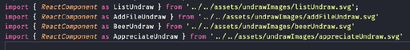

# Polimorfismo

## Versionamento


versão | data | Modificação | Autor
-------|------|-------------|------
0.1.0 | 05/01/2023 | Criação do documento | Samuel Avila

*Tabela 1: Versionamento*

## Introdução

Esse princípio tem origem no paradigma da Programação Orientada à Objetos. Basicamente, o conceito de poliformismo trata da capacidade de um objeto, função ou variável, assumir diferentes formas, na prática, ele permite tratar objetos diferentes como o objeto base.

## Polimorfismo na aplicação Copo Cheio

O polimorfismo é um princípio extremamente importante para reutilização e melhoria na semântica do código. Assim, podemos demonstrar como ele foi utilizado (e continua sendo) tanto no _front_ quanto no _back_ da aplicação.

### Polimorfismo de subtipos

No caso do nosso projeto, utilizamos o tipo de polimorfismo mais comum: o de subtipos. Nesse caso temos uma classe 'HttpException' que se refere aos erros que podem ser gerados pela aplicação, a partir dessa classe, sõa geradas 4 classes filhas, com os mesmos atributos. Assim, o polimofirsmo é evidenciado no método construtor das classes filhas, onde sobreescrevemos o método construtor original, assim nos referindo a um erro específico e não a erros genéricos. 

```
export class HttpException extends Error{
    statusCode: number

    constructor(statusCode: number, message: string) {
      super(message)
  
      Object.setPrototypeOf(this, new.target.prototype)
      this.name = Error.name
      this.statusCode = statusCode
      Error.captureStackTrace(this)
    }
}

export class BadRequestException extends HttpException {
    constructor(message: string) {
        super(400,message)
    }
}

export class UnauthorizedRequestException extends HttpException {
    constructor(message: string) {
        super(401,message)
    }
}

export class ForbiddenRequestException extends HttpException {
    constructor(message: string) {
        super(403,message)
    }
}

export class NotFoundRequestException extends HttpException {
    constructor(message: string) {
        super(404,message)
    }
}
```

Outro caso de uso do polimorfismo em nosso projeto foi para possibilitar a rederização de imagens SVG. Por padrão não tem algo que renderize SVGs no React, portanto utilizamos a sintaxe do 'as' para que pudessemos tratas a imagem como um _React Component_.



*Imagem 01: Exemplo de polimorfismo no front-end*

## Referências

[1] LogRocket [LogRocket](https://blog.logrocket.com/build-strongly-typed-polymorphic-components-react-typescript/#how-to-use-typescript-build-strongly-typed-polymorphic-components-react). Material disponível online. Acesso em: 3 de janaeiro de 2023.
[2] Bmc Blogs [Bmc](https://www.bmc.com/blogs/polymorphism-programming/). Material disponível online. Acesso em: 4 de janeiro de 2023
[3] Techopedia [Techopedia](https://www.techopedia.com/definition/28106/polymorphism-general-programming). Material disponível online. Acesso em: 4 de janeiro de 2023.
[4] Microsoft [Microsoft](https://learn.microsoft.com/pt-br/dotnet/csharp/fundamentals/object-oriented/polymorphism). Material disponível online. Acesso em 5 de janeiro de 2023.