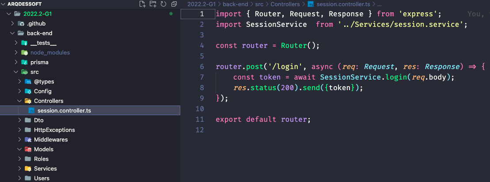

# Controller (GRASP)

Versionamento

versão | data | Modificação | Autor
-------|------|-------------|------
0.1.0 | 05/01/2023 | Criação do documento | Alan M.
0.1.1 | 06/01/2023 | Adição do versionamento | Paulo Henrique

## Introdução

  O padrão Controller (controlador) do GRASP, atribui responsabilidade de eventos do sistema a uma classe que não seja de interface de usuário. Essa classe manipula todos os eventos pertinentes a seu domínio de caso de uso e separa explicitamente a camada de serviço de sistema da de domínio. Ela também só deve delegar o trabalho para outros objetos, somente controlando e coordenando.

## Aplicação do Controller

  No projeto Copo Cheio foi utilizado esse padrão na criação de uma classe especifica para declaração da interface de serviços disponíveis na API e sua configuracão, separando assim das regras de negócio (Services) e Domínio (Model), buscando que essa classe somente controle a execução.

  Na imagem abaixo é possível ver a aplicação de uma controller que possuí declação do serviço de Login, relacionada a sessão de um usuário no sistema, chamando regra de négocio e domínio implementadas na classe <a href="https://github.com/UnBArqDsw2022-2/2022.2-CopoCheio/blob/main/back-end/src/Controllers/session.controller.ts">SessionController</a>.

*Figura 1: Versão 1.0 do Classe session e estrutra de pasta para aplicação do pattern Controller do GRASP* 

## Referências

* GRASP (padrão orientado a objetos). In: WIKIPÉDIA: a enciclopédia livre. Disponível em: https://pt.wikipedia.org/wiki/GRASP_(padr%C3%A3o_orientado_a_objetos). Acesso em: 5 jan. 2023.

* Understanding the GRASP Design Patterns. In: Medium. Disponível em: https://medium.com/@ReganKoopmans/understanding-the-grasp-design-patterns-2cab23c7226e. Acesso em: 5 jan. 2023.