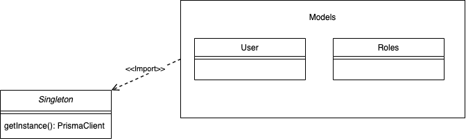
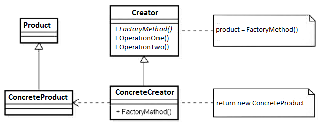
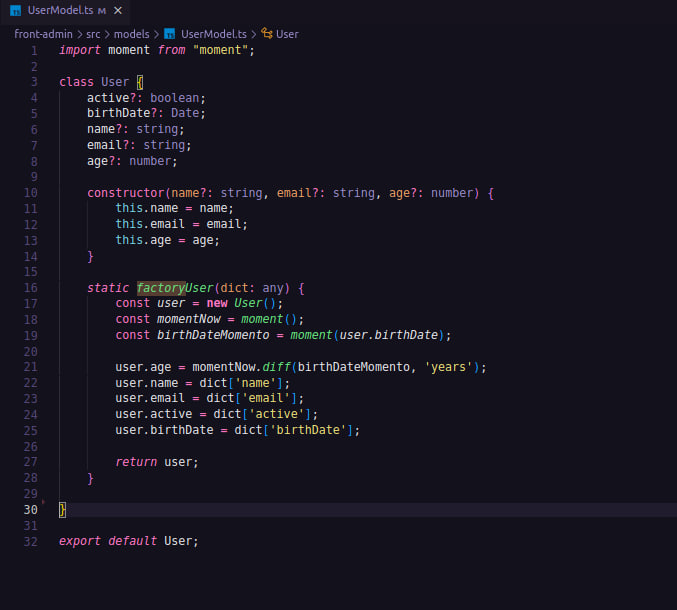

# 3.2.1 GoFs Criacionais

Versionamento

versão | data | Modificação | Autor
-------|------|-------------|------
0.1.0 | 06/01/2023 | Criação do documento | Arthur Matos
0.1.1 | 06/01/2023 | Adição Factory method | Paulo Rezende
0.1.3 | 06/01/2023 | Correção documento | Leonardo Takehana

*Tabela 1: Versionamento*

## 3.2.1.1 Singleton

### 3.2.1.1.1 Introdução

O padrão criacional Singleton ataca uma problemática específica relacionada a utilização de classes de inicialização lenta e/ou uso global, sendo garantido que exista na aplicação apenas uma instância daquele objeto e que essa instância tenha acesso global para as demais classes que a utilizam.

### 3.2.1.1.2 Problemática apresentada 

Para a aplicação do "Copo Cheio" foi selecionada a utilização da ORM Prisma para o tratamento da comunicação com o banco de dados. Tal ORM apresenta uma interface de Cliente de banco de dados (PrismaClient), que por si realiza a comunicação com o banco.

A problemática se dá ao fato que a classe estabelece uma forma de conexão com nosso banco postgres, de forma que o instanciar de múltiplos objetos dessa classe pode acarretar em uma sobrecarga desnecessária.

Por isso a proposta de utilização do Singleton a partir dessa classe foi estabelecida. A intenção foi criar uma instância única da conexão com o PrismaClient e tornar o acesso, feito especialmente pelas models, simples a partir do importar da instância de conexão.



### 3.2.1.1.3 Aplicação Inicial Singleton 

A proposta inicial de aplicação do singleton se apresentou da seguinte forma.

```
import { PrismaClient } from "@prisma/client";

class Singleton {
    private static instance: PrismaClient;

    public static getInstance(): PrismaClient {
        if (!Singleton.instance) {
            Singleton.instance = new PrismaClient();
        }

        return Singleton.instance;
    }
}

const prisma = Singleton.getInstance();

export default prisma
```
## 3.2.1.2 Factory method

### 3.2.1.2.1 Introdução

O Factory Method é um padrão criacional de projeto que fornece uma interface para criar objetos em uma superclasse, mas permite que as subclasses alterem o tipo de objetos que serão criados. Contudo, existe uma outra forma de aplicar esse padrrão criacional com um método static da própria super classe.

### 3.2.1.2.2 Problemática apresentada 

O padrão Factory Method sugere que você substitua chamadas diretas de construção de objetos (usando o operador new) por chamadas para um método fábrica especial. OS objetos ainda são criados através do operador new, mas estão sendo chamado de dentro do método fábrica. Objetos retornados por um método fábrica geralmente são chamados de produtos no caso exemplar será um user.




### 3.2.1.2.3 Aplicação Factory Method

A proposta inicial de aplicação do factory method se apresentou da seguinte forma.



## Referências