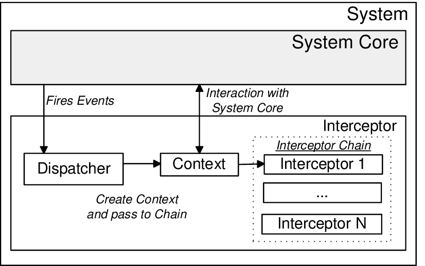

# 3.2. Módulo Padrões de Projeto GoFs

## 3.2.2 GoFs Arquiteturais - Interceptor

### 3.2.1.1 Introdução

O Interceptor  um Padrão de projeto arquitetural que tem como propósito permitir que serviços ou outras classes sejam chamadas automaticamente quando um certo evento ocorrer, por exemplo, quando um método específico é chamado, ou até qualquer método de uma classe específica.

### 3.2.1.1 Problemática apresentada 

### 3.2.1.1 Aplicação Inicial do MOkc Object 

