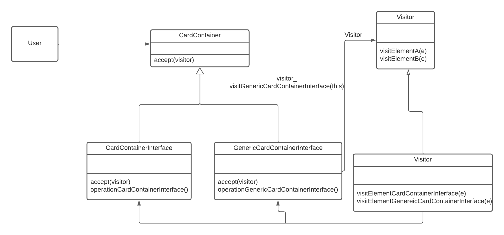

# GoFs Comportamentais

## Visitor

### Introdução

O Visitor Pattern é um padrão de projeto de software que permite que você adicione novas operações a classes de objetos sem alterar suas classes. Ele faz isso criando uma classe de visitante separada que contém as novas operações e, em seguida, passando os objetos das classes a serem alteradas para o visitante para que as operações possam ser realizadas. Isso permite que você altere facilmente o comportamento de um conjunto de objetos sem precisar alterar as classes dos objetos em si. Ele é útil quando você tem um conjunto de classes em um sistema e precisa adicionar novas operações a essas classes de maneira organizada e eficiente.


### Problemática apresentada

Para a aplicação do "Copo Cheio" foi feita a criação de cards de receitas de bebidas, na qual cada card possui diversas informações, como nome, tempo médio de preparo, nível de dificuldade, país de origem e as bebidas que são envolvidas no drink. Utilizamos o Design Pattern Visitor pois ele separa um algoritmo de uma estrutura de objeto movendo a hierarquia de métodos em um objeto (cards). O padrão Visitor permite adicionar novas operações a uma estrutura de objetos sem alterar as classes dos objetos.
### Aplicação Inicial do Visitor

```
import styled, { css } from 'styled-components';
import React,{ ReactNode } from 'react';
import {colors} from '../../styles/colors';


interface CardContainerInterface {
    width?: string;
    height?: string;
    borderRadius?: string;
    hover?:boolean;
    borderColor?: string;
    containerType?: string;
    backgroundImage?: string;
    children:ReactNode;
    onMouseEnter?: VoidFunction;
    onMouseLeave?: VoidFunction;
}

interface GenericCardContainerInterface extends Omit<CardContainerInterface, "children"> {
    typeDefinition: string
}

const GenericCardContainer = styled.div<GenericCardContainerInterface>`
    display: flex;
    flex-direction:column;
    padding: 0px;
    border-radius: ${({ borderRadius }) => borderRadius || '16px'};
    outline: none;
    border: none;
    ${({ height,width,borderColor,backgroundImage, typeDefinition }) => {
        switch (typeDefinition){
            case 'background':
                    return css`
                        height: ${height};
                        width: ${width};
                        background-color:  ${borderColor};
                        box-shadow: 0px 4px 5px rgba(0, 0, 0, 0.14);
                    `
            case 'image':
                    return css`
                        margin:0px;
                        height: calc(${height} - 5.2px);
                        width: ${width};
                        background-image: url(${backgroundImage});
                        background-size: cover;
                    `
            case 'main':
                return css`
                    height: calc(${height} - 17.2px);
                    width: calc(${width} - 24px);
                    padding:12px;
                    padding-bottom:0px;
                `
            case 'hover':
                return css`
                    height: calc(${height} - 17.2px);
                    width: calc(${width} - 24px);
                    background: ${colors.black}E6;
                    padding:12px;
                    padding-bottom:0px;
                `
        }
    }};
`

const CardContainer = ({
    width,
    height,
    borderRadius,
    borderColor,
    backgroundImage,
    hover,
    children,
    onMouseEnter,
    onMouseLeave,
}: CardContainerInterface) => {
    return (
        <GenericCardContainer
            data-testid='card container'
            typeDefinition={'background'}
            width={width}
            height={height}
            borderRadius={borderRadius}
            borderColor={borderColor}
            onMouseEnter={onMouseEnter}
            onMouseLeave={onMouseLeave}
        >

            <GenericCardContainer
                typeDefinition={'image'}
                width={width}
                height={height}
                borderRadius={borderRadius}
                backgroundImage={backgroundImage}
            >
                <GenericCardContainer
                    typeDefinition={hover ? 'hover' : 'main'}
                    width={width}
                    height={height}
                    borderRadius={borderRadius}
                    backgroundImage={backgroundImage}
                >
                    {children}
                </GenericCardContainer>
            </GenericCardContainer>
        </GenericCardContainer>
    )
}

export default CardContainer;
```
