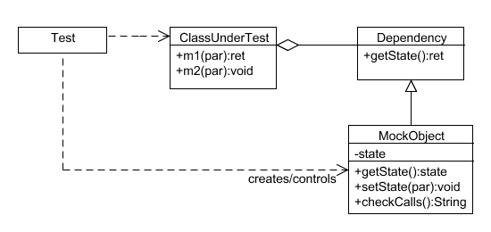

# 3.3 Padrões Arquiteturais

Versionamento

versão | data | Modificação | Autor
-------|------|-------------|------
0.1.0 | 06/01/2023 | Criação do documento | Ciro Costa
0.1.1 | 06/01/2023 | Adição da introdução e problema para mock | Artur de Sousa
0.1.1 | 06/01/2023 | Finalização do documento | Ciro Costa


*Tabela 1: Versionamento*
## 3.3.1 Mock Object

### 3.3.1.1 Introdução

O Mock Object é um Padrão de projeto arquitetural que tem como propósito substituir um Objeto, simulando o comportamento dele, com o objetivo de eliminar dependencias e dar mais controle na hora de testar funcionalidades do sistema.



### 3.3.1.2 Problemática apresentada 

Para a aplicação "Copo Cheio", assim como todo software, fazer testes unitários é de grande importância, sendo assim, o Mock Object é uma ótimo saída para a simulação de objetos complexos, principalmente em questão de objetos que podem ter resultados variados e que afetam outras partes do sistema, como por exemplo a criação de usuários.

### 3.3.1.2 Aplicação Inicial do Mock Object 
A aplicação se deu desse jeito

```
test('should update a users name and password ', async () => {
    const userMock = {
        id: "9c0b623a-aca6-4caa-8d8e-bee8af4fa1ab",
        email: "joao@fkmail.com",
        nameComplete: "Joao2",
        password: '12',
        birthDate: moment("2023-01-04T03:21:09.000Z").toDate(),
        createdDate: moment("2023-01-04T03:21:09.000Z").toDate(),
        roleId: "9c0b623a-aca6-4caa-8d8e-bee8af4fa1ab",
        active: true
    }

    prismaMock.user.update.mockResolvedValue(userMock)
    const user = new Users(prismaMock.user)

    await expect(user.update({name:"Joao2", password:'12'},userMock.id)).resolves.toEqual(userMock)
    expect(updateMock).toHaveBeenCalled();

})
```
## 3.3.2 Interceptor

### 3.3.2.1 Introdução

O Interceptor  um Padrão de projeto arquitetural que tem como propósito permitir que serviços ou outras classes sejam chamadas automaticamente quando um certo evento ocorrer, por exemplo, quando um método específico é chamado, ou até qualquer método de uma classe específica.


### 3.3.2.2 Problemática apresentada 

A fim de ter um maior controle sobre erros disparados no sistema foi introduzido um middleware que intercepta erros disparados e da um tratamento adequado a ele.

### 3.3.2.3 Aplicação Inicial do Interceptor

```
export const HttpExceptionHandler = (
        error: HttpException,
        req: Request,
        res: Response,
        next: NextFunction
        ) => {
        const status = error.statusCode || 400
        
        res.header("Content-Type", 'application/json')
        res.status(status).send({error:error.message})
  }
```
