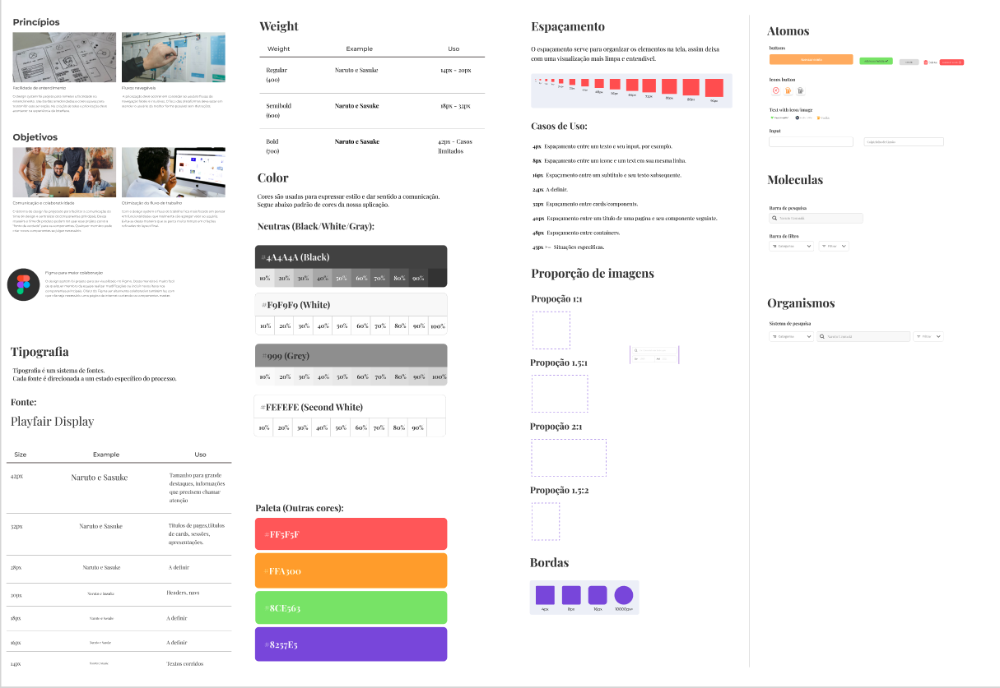
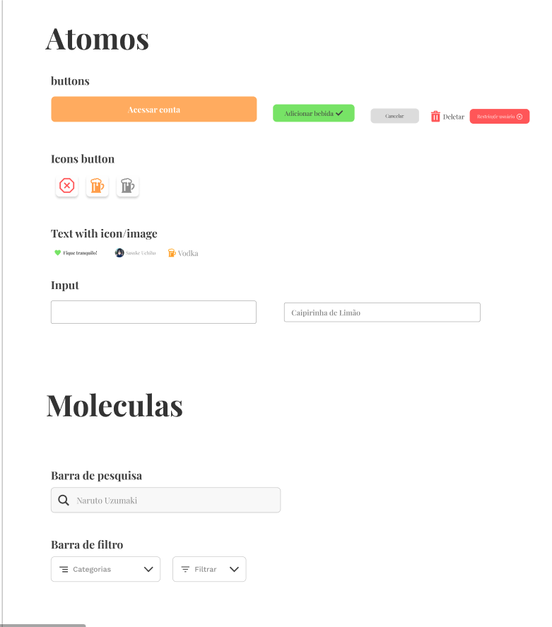
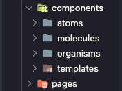
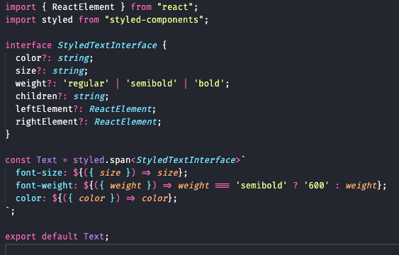
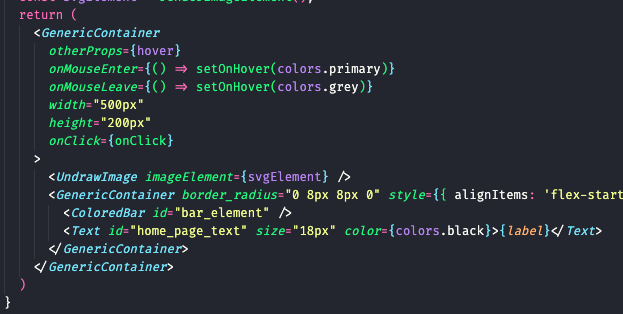
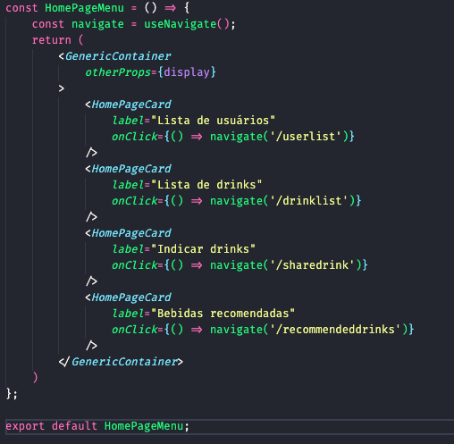
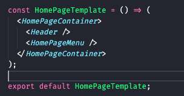
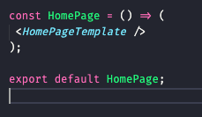

# 3.3. Módulo Padrões de Projeto Extras

## Versionamento

versão | data | Modificação | Autor
-------|------|-------------|------
0.1.0 | 05/01/2023 | Criação e finalização do documento | Gabriel Sabanai Trindade

## 3.3.1 Atomic Design
O Atomic Design é uma metodologia de padão de estruturação de design criada em 2016 por Brad Frost. Entretanto, Brad começou a idealização de seu padrão desde 2013 ao distribuir diversos componentes UI em uma folha de papel e elencar eles a distribuição de atomos e criações de moleculas provindas das áreas de estudos da química.

Ao se inspirar nos estudos das ciências naturais, Brad conseguiu assemelhar a definição de uma página web igual a uma comunidade viva, ou seja, é composta por elementos fluídos, interdenpendentes, que interagem entre sí e que, principalmente, escala e evoluí de forma orgânica. Dessa forma, a ideia por trás do atomic design é conseguir destruturar componentes complexos em componentes mais simples que serão reutilizados e agrupados para formar componentes complexos.

### Metodologia

_Figura 1: Metodologia Atomic Design_

A metodologia do Atomic Design é dividia em cinco estagios que ao trabalharem juntos, criam uma interface de forma mais deliberada e hierarquica, importante ressaltar que seu processo de criação não é linear, ele tem como objetivo atuar parecidamente a um mapa mental. Os cinco estagios são:

* Atoms
* Molecules
* Organisms
* Templates
* Pages

#### Atomos

O atomo serve como a menor parte fundamental para a construção de nossas interfaces, os atomos são os elementos HTML basicos que é impossível quebra-los em partes menores.

#### Moleculas

Uma molecula é um simples grupo elementos UI(atomos) funcionando juntos como uma unidade. Os mesmos elementos unidos de forma diferente podem criar uma molecula diferente.

#### Organismos

Um organismo é um componente UI mais complexo composto por moleculas e/ou atomos e/ou outros organismos que formam interfaces mais elaboradas.

#### Templates

Um template é a junção de todos os nossos atomos, moleculas e organismos agrupados de forma estática para criar o escopo de uma página.

#### Paginas

Uma página é a instancia dos nossos componentes passando para eles as informações necessárias, tornando o template dinamico.

### Aplicando dentro do projeto

O processo de aplicação do Atomic Design começou desde o processo de design do projeto. Foi criado um Design System para que tivessemos todos os padrões de estilização bem definidos para a construção dos elementos UI, segue exemplo abaixo na figura 2.

_Figura 2: Design System_

Como pode ser observado, dentro do Design System já começa a elaboração de nossos componentes, como é possível ver na figura 3.

_Figura 3: Componentes_

Já no desenvolvimento do projeto, é estabelecido a estrutura de pasta como é mostrado na figura 4.

_Figura 4: Estrutura de Pastas_

Por fim, segue agora a construção de uma página desde a criação de um atomo até a instância do template em sí.

#### Atomo de texto
É criado o atomo de texto, segue exemplo na figura 5.

_Figura 5: Atomo texto_

#### Molecula de card

É construido a molecula **HomePageCard** utilizando esse atomo texto, juntamente, com outros atomos. Segue exemplo na figura 6.

_Figura 6: Molecula card_

#### Organismo Menu

Cria-se o Organismo Menu utilizando esses quatro das moleculas card e um atomo. Segue exemplo na figura 7.

_Figura 7: Organismo menu_

#### Template Home

Com o organismo Menu e o organismo Header junto, foi criado o template da página. Segue exemplo abaixo na figura 8.

_Figura 8: Template menu_

#### Pagina Home

Dentro da página home é feito o instanciamento do template home. Segue exemplo abaixo na figura 9.

_Figura 9: Pagina home_

## Referências

Atomic Design by Brad Frost - https://atomicdesign.bradfrost.com/